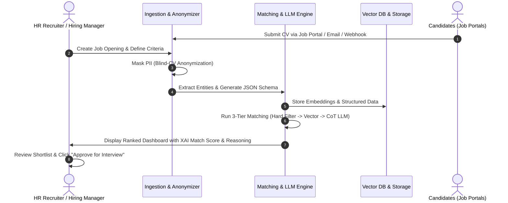
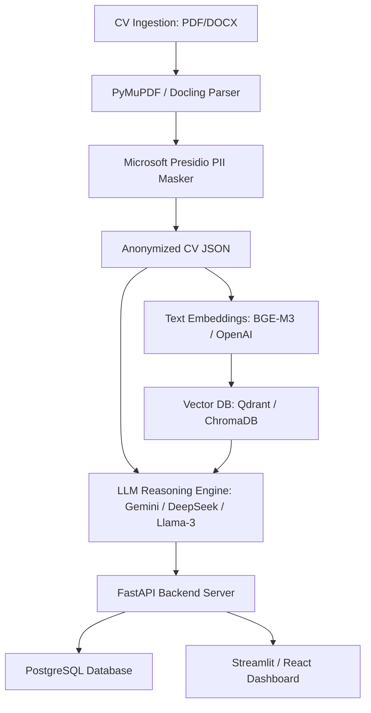

# Product Requirement Document (PRD)
## Autonomous Candidate Screening Platform (AI-Powered Talent Acquisition Engine)

| Metadata | Detail |
| :--- | :--- |
| **Document Title** | Autonomous Candidate Screening Platform PRD |
| **Project Name** | TalentAI Screening Engine |
| **Author** | AI/ML Specialist |
| **Target Audience** | Technical Assessors, HR Executive Team, System Engineers |
| **Version** | v1.0.0 |
| **Status** | Approved for PoC Implementation |
| **Date** | 19 Agustus 2026 |

---

## 1. Executive Summary & Business Context

### 1.1 Latar Belakang
Perusahaan manufaktur yang sedang dalam fase pertumbuhan pesat mengalami lonjakan kebutuhan perekrutan karyawan (*high-volume rapid hiring*). Saat ini, proses penapisan (*screening*) Kurikulum Vitae (CV) dilakukan secara manual oleh tim Human Resources (HR). 

Proses seleksi manual ini memiliki beberapa masalah kritis:
1. **Inefisiensi Waktu & Biaya:** Membutuhkan rata-rata 15–20 menit per CV, menyebabkan penumpukan berkas pelamar (*backlog*) dan *Time-to-Hire* yang lambat.
2. **Kerentanan Bias Manusia:** Seleksi manual rentan terhadap bias subjektif (bias gender, usia, almamater, format visual CV, atau kelelahan manusia saat memeriksa ratusan CV).
3. **Kualitas Matching yang Tidak Konsisten:** Pencocokan kualifikasi sulit terukur secara presisi tanpa standar penilaian terstruktur.

### 1.2 Tujuan Produk
Membangun platform penapisan kandidat berbasis **AI/ML end-to-end** yang mengotomatiskan seluruh siklus seleksi CV dari berbagai portal kerja hingga rekomendasi daftar singkat (*shortlist*) kandidat terurut, transparan, objektif, dan dapat dipertanggungjawabkan (*explainable*).

### 1.3 Key Performance Indicators (KPIs)
* **Time-to-Screen Reduction:** Mengurangi waktu penapisan CV hingga **> 90%** (dari ~15 menit menjadi **< 3 detik** per CV).
* **Cost Efficiency:** Menghemat biaya operasi penapisan hingga **75%**.
* **Bias Elimination:** 100% CV diproses secara *blind-screening* (tanpa akses ke PII sensitif saat tahap kualifikasi).
* **Accuracy & Relevance:** Tingkat kesesuaian rekomendasi AI dengan keputusan akhir *Hiring Manager* mencapai **> 85%**.

---

## 2. Target User Personas & User Journeys

### 2.1 Personas
1. **HR Recruiter (Primary User):** Mengelola lowongan pekerjaan, mengunggah/mengimpor CV, melihat perankingan kandidat, serta menyetujui rekomendasi wawancara.
2. **Hiring Manager (Secondary User):** Menentukan kualifikasi & kriteria lowongan, meninjau skor kecocokan kandidat, serta membaca catatan analisis AI (*pros/cons*).
3. **AI System Admin (Technical User):** Memantau performa model, mengelola prompt/rubrik penilaian, dan meninjau audit trail etika AI.

### 2.2 End-to-End User Journey


---

## 3. Fitur Utama & Functional Requirements (FR)

### FR-1: Automated CV Ingestion & Multi-Source Collection
* **FR-1.1:** Sistem harus mendukung pengumpulan CV secara otomatis dari berbagai channel: Job Portal Webhooks/API (LinkedIn, Jobstreet, Glints), Ingestion via Email (IMAP/SMTP parsing), dan Unggah Manual secara *Batch* (PDF/DOCX/PNG/JPG).
* **FR-1.2:** Sistem harus menyediakan antrean tugas (*Task Queue/Celery*) untuk menangani lonjakan ribuan CV secara simultan tanpa *timeout*.

### FR-2: Blind-CV Anonymizer & Ethical Shield (Mitigasi Bias)
* **FR-2.1:** Sebelum analisis kualifikasi, sistem wajib melakukan pencabutan/penutupan informasi identitas pribadi (*Person Identifiable Information / PII Masking*).
* **FR-2.2:** Elemen yang di-masking secara otomatis meliputi:
  * Nama Lengkap Kandidat
  * Foto Profil & Jenis Kelamin
  * Usia / Tanggal Lahir
  * Agama / Suku / Kewarganegaraan
  * Alamat Lengkap / Domisili Sensitif
  * Nama Spesifik Perguruan Tinggi (diganti kategorisasi netral seperti: *"Akreditasi A / Equivalent"* jika diperlukan).

### FR-3: Multi-Modal CV Parsing & Entity Extraction
* **FR-3.1:** Sistem harus dapat memproses dokumen tak terstruktur dengan berbagai tata letak (1 kolom, 2 kolom, tabel, atau hasil *scan* dokumen).
* **FR-3.2:** Menggunakan *Layout-aware Document Parsing* + OCR untuk mengekstrak entity terstruktur:
  * *Work History:* Jabatan, Nama Perusahaan, Durasi (Bulan/Tahun), Deskripsi Tugas & Pencapaian.
  * *Education:* Tingkat Pendidikan (D3/S1/S2), Jurusan, Tahun Lulus.
  * *Hard & Soft Skills:* Daftar keterampilan teknis, sertifikasi, keahlian bahasa.

### FR-4: Multi-Tier Hybrid Matching & Scoring Engine
Sistem pencocokan menggunakan **3 Layer Penilaian**:

```
 ┌──────────────────────────────────────────────────────────┐
 │ Layer 1: Hard Filter (Knockout Criteria)                 │
 │ (Filter instan: Min. Pendidikan, Lisensi Wajib, dll)    │
 └────────────────────────────┬─────────────────────────────┘
                              │ Passed
                              ▼
 ┌──────────────────────────────────────────────────────────┐
 │ Layer 2: Vector Semantic & Skill Graph Matching         │
 │ (Cosine similarity deskripsi kerja vs kriteria kualifikasi)│
 └────────────────────────────┬─────────────────────────────┘
                              │ Candidates
                              ▼
 ┌──────────────────────────────────────────────────────────┐
 │ Layer 3: LLM Chain-of-Thought (CoT) Deep Assessment      │
 │ (Evaluasi kualitas achievement, kompleksitas proyek)    │
 └──────────────────────────────────────────────────────────┘
```

* **FR-4.1 (Layer 1 - Hard Filter):** Mengeliminasi kandidat yang tidak memenuhi syarat mutlak secara instan (contoh: Pendidikan Min. S1 Teknik Mesin, Wajib memiliki Sertifikat K3).
* **FR-4.2 (Layer 2 - Semantic Embedding):** Menghitung derajat kemiripan makna menggunakan *Vector Embeddings* & *Skill Graph Taxonomy* (mampu mengenali konseptual seperti `Python` = `Data Science` = `Machine Learning`).
* **FR-4.3 (Layer 3 - LLM CoT Scoring):** LLM melakukan analisis kualitatif terhadap relevansi pengalaman dan memberikan bobot skor 0 - 100%.

### FR-5: Explainable AI (XAI) Output & Shortlisting
* **FR-5.1:** Setiap kandidat yang diperingkatkan harus dilengkapi dengan laporan transparansi:
  * **Overall Fit Score (%)** (Misal: 88%)
  * **Breakdown Score:** Technical Skills Match (90%), Experience Match (85%), Education Match (90%).
  * **Key Strengths (Pros):** Alasan utama kandidat ini direkomendasikan.
  * **Potential Gaps / Risk Factors (Cons):** Hal yang menjadi kekurangan atau area kritis.
  * **Tailored Interview Questions:** 3-5 pertanyaan wawancara spesifik berdasarkan celah (*gap*) dalam CV kandidat.

### FR-6: HR Dashboard & Human-in-the-Loop (HITL) Workflow
* **FR-6.1:** Dashboard menyediakan antarmuka terurut (*ranked list*) berdasarkan skor kriteria.
* **FR-6.2:** Fitur filter dinamis berdasarkan skor kecocokan, pengalaman minimum, atau *keyword skill*.
* **FR-6.3:** *Action Button* untuk HR: `Approve for Interview`, `Reject`, atau `Hold`.
* **FR-6.4:** *Feedback Loop:* Ketika HR melakukan *override* (menolak kandidat skor tinggi atau sebaliknya), sistem mencatat alasan HR untuk kalibrasi kriteria di masa mendatang.

---

## 4. Non-Functional Requirements (NFR)

### NFR-1: Performa & Skalabilitas
* **Latency:** Ekstraksi dan evaluasi per CV tidak boleh melebihi **3 detik**.
* **Throughput:** Sanggup memproses hingga **10.000 CV per hari** dengan arsitektur mikroservis berorientasi antrean (*Queue-driven worker*).

### NFR-2: Etika AI & Mitigasi Bias
* **Fairness Guarantee:** Algoritma scoring dilarang memanfaatkan atribut demografi non-profesional.
* **Auditability:** Setiap skor dan analisis yang dihasilkan LLM harus disimpan beserta versi prompt dan versi model yang digunakan.

### NFR-3: Keamanan & Data Compliance
* **Data Privacy:** Memenuhi standar Regulasi Pelindungan Data Pribadi (UU PDP / GDPR). CV asli disimpan dalam enkripsi *AES-256*, dan data di-anonymized sebelum diproses oleh pihak ketiga (API AI).
* **Role-Based Access Control (RBAC):** Hanya staf HR terotorisasi yang dapat membuka kunci data identitas asli (*unmasking PII*) kandidat yang lolos *shortlist*.

---

## 5. Technical Stack & Architecture



* **Programming Language:** Python 3.11+
* **Framework:** FastAPI (Backend API), Streamlit / React (Dashboard UI)
* **Document Processing & OCR:** `Docling`, `PyMuPDF`, `Tesseract OCR`
* **PII Masking:** `Microsoft Presidio Anonymizer`
* **Vector Database:** `Qdrant` / `ChromaDB`
* **Embeddings & LLM:** `BGE-M3` / `OpenAI text-embedding-3`, `Gemini 1.5 Flash` / `DeepSeek-V3` / `Llama-3.1`
* **Relational Database:** `PostgreSQL` (Metadata & Audit Logs)

---

## 6. Data Schema Specifications

### 6.1 Anonymized Candidate JSON Schema
```json
{
  "candidate_id": "CAND-89412",
  "anonymized_profile": {
    "education": [
      {
        "degree": "Bachelor of Engineering",
        "major": "Mechanical Engineering",
        "institution_category": "Accredited Grade A",
        "graduation_year": 2022
      }
    ],
    "work_experience": [
      {
        "role": "Production Quality Engineer",
        "duration_months": 36,
        "key_achievements": [
          "Implemented Six Sigma methodologies reducing line defect rates by 14%",
          "Managed automated conveyor inspection systems"
        ]
      }
    ],
    "skills": ["Six Sigma", "AutoCAD", "PLC Programming", "ISO 9001", "Quality Control"],
    "certifications": ["Certified Six Sigma Green Belt"]
  }
}
```

### 6.2 Match Result Schema (XAI Output)
```json
{
  "candidate_id": "CAND-89412",
  "job_id": "JOB-MFG-002",
  "overall_fit_score": 88.5,
  "score_breakdown": {
    "technical_skills_fit": 92.0,
    "experience_depth_fit": 85.0,
    "education_fit": 90.0
  },
  "status": "SHORTLISTED",
  "justification": {
    "pros": [
      "Memiliki pengalaman langsung 3 tahun di bidang Quality Engineering manufaktur.",
      "Memiliki sertifikasi Six Sigma Green Belt yang sesuai dengan kriteria utama lowongan."
    ],
    "cons": [
      "Pengalaman pada sistem SCADA masih tingkat dasar."
    ],
    "recommended_interview_questions": [
      "Bisakah Anda menceritakan pengalaman penerapan Six Sigma yang berhasil menurunkan defect rate 14%?",
      "Sejauh mana keterlibatan Anda dalam integrasi sistem SCADA dengan PLC?"
    ]
  }
}
```

---

## 7. Scope & Plan untuk Proof of Concept (PoC)

Untuk memenuhi tenggat waktu uji teknis (3 hari), PoC dirancang mencakup:
1. **Interactive HR Dashboard:** Antarmuka Streamlit/Web UI untuk mengunggah CV, memilih Job Description, dan melihat hasil ranking real-time.
2. **Parsing & Anonymization Engine:** Script otomatisasi untuk menyamarkan PII dan mengekstrak entitas CV.
3. **Multi-Criteria Scoring Demo:** Evaluasi kandidat menggunakan kombinasi *Hard Filter* + *Vector Similarity* + *LLM Reasoning*.
4. **Exportable XAI Report:** Fitur unduh laporan hasil seleksi dalam format JSON / PDF / Excel.

---

## 8. Tanggal & Persetujuan Dokumen

* **Dibuat Oleh:** AI Specialist
* **Lokasi Repository:** `D:\Github\Autonomous_Candidate_Screening_Platform`
* **File PRD:** `D:\Github\Autonomous_Candidate_Screening_Platform\PRD.md`
