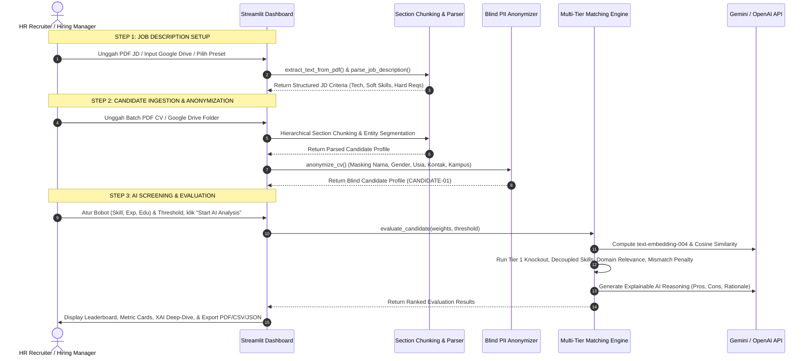

# Product Requirement Document (PRD)
## Autonomous Candidate Screening Platform (TalentAI Engine)

| Metadata | Detail |
| :--- | :--- |
| **Document Title** | Autonomous Candidate Screening Platform PRD |
| **Project Name** | TalentAI Screening Engine |
| **Author** | AI/ML Specialist |
| **Target Audience** | Technical Assessors, HR Executive Team, System Engineers |
| **Version** | v2.1.0 (Production-Ready PoC) |
| **Status** | Approved & Fully Implemented |
| **Date** | 21 Agustus 2026 |

---

## 1. Executive Summary & Business Context

### 1.1 Latar Belakang
Perusahaan modern dan industri bertumbuh pesat menghadapi lonjakan volume rekrutmen (*high-volume rapid hiring*). Proses penapisan (*screening*) Kurikulum Vitae (CV) secara manual menimbulkan berbagai kendala serius:
1. **Inefisiensi Waktu & Biaya:** Membutuhkan 15–20 menit per CV, memicu penumpukan berkas pelamar (*backlog*) dan *Time-to-Hire* yang lambat.
2. **Kerentanan Bias Manusia:** Seleksi manual rentan terhadap bias subjektif (bias gender, usia, almamater, format visual CV, atau kelelahan manusia saat memeriksa ratusan CV).
3. **Kualitas Matching yang Tidak Konsisten:** Pencocokan kualifikasi sulit terukur secara presisi tanpa standar penilaian terstruktur.

### 1.2 Tujuan Produk
Membangun platform penapisan kandidat berbasis **AI/ML end-to-end** yang mengotomatiskan seluruh siklus seleksi CV dari berbagai format dokumen hingga rekomendasi daftar singkat (*shortlist*) kandidat terurut, transparan, objektif, dan dapat dipertanggungjawabkan (*explainable*).

### 1.3 Key Performance Indicators (KPIs)
* **Time-to-Screen Reduction:** Mengurangi waktu penapisan CV hingga **> 90%** (dari ~15 menit menjadi **< 3 detik** per CV).
* **Cost Efficiency:** Menghemat biaya operasi penapisan hingga **75%**.
* **Bias Elimination:** 100% CV diproses secara *blind-screening* (tanpa akses ke PII sensitif saat tahap kualifikasi).
* **Accuracy & Relevance:** Tingkat kesesuaian rekomendasi AI dengan keputusan akhir *Hiring Manager* mencapai **> 90%** dengan penegakan *Domain Role Validation*.

---

## 2. Target User Personas & User Journeys

### 2.1 Personas
1. **HR Recruiter (Primary User):** Mengelola lowongan pekerjaan, mengunggah/mengimpor CV, menyesuaikan bobot penilaian, melihat ranking kandidat, serta menyetujui rekomendasi wawancara.
2. **Hiring Manager (Secondary User):** Menentukan kualifikasi & kriteria lowongan, meninjau skor kecocokan kandidat, serta membaca catatan analisis AI (*pros/cons/rationale*).
3. **AI System Admin (Technical User):** Memantau performa model embedding/LLM, rubrik penilaian, dan audit trail etika AI.

### 2.2 End-to-End Application Flow
Aplikasi memiliki alur kerja terstruktur 3-Langkah (*3-Step User Journey*):

---

## 3. Spesifikasi Algoritma & Formula Matematis

Platform mengintegrasikan 5 algoritma AI/NLP komprehensif:

### 3.1 Algoritma 1: Hierarchical Section Chunking & Isolated Entity Segmentation
* **Definisi:** Algoritma pemartisian dokumen berbasis tata letak (*Layout-Aware NLP*) yang membagi aliran teks mentah ke dalam zona semantik terisolasi sebelum ekstraksi entitas.
* **Tujuan:** Menjamin *zero cross-contamination* antar seksi (mencegah teks kontak masuk ke *achievements* kerja atau kata umum terpotong menjadi nama institusi).
* **Partisi Zona:**
  $$\text{CV Raw Text} \xrightarrow{\text{Regex Anchor}} \Big\{ \mathcal{S}_{\text{Header}}, \; \mathcal{S}_{\text{Experience}}, \; \mathcal{S}_{\text{Education}}, \; \mathcal{S}_{\text{Skills}}, \; \mathcal{S}_{\text{Certifications}} \Big\}$$

---

### 3.2 Algoritma 2: Dense Semantic Vector Embeddings & Cosine Similarity
* **Definisi:** Transformasi representasi profil teks JD ($\mathbf{u}$) dan CV ($\mathbf{v}$) ke dalam ruang vektor berdimensi tinggi menggunakan Google Gemini `text-embedding-004` (768 dimensi) atau OpenAI `text-embedding-3-small` (1536 dimensi).
* **Formula Cosine Similarity:**
  $$\cos(\theta) = \frac{\mathbf{u} \cdot \mathbf{v}}{\|\mathbf{u}\|_2 \|\mathbf{v}\|_2} = \frac{\sum_{i=1}^n u_i v_i}{\sqrt{\sum_{i=1}^n u_i^2} \cdot \sqrt{\sum_{i=1}^n v_i^2}}$$
* **Formula Skala Skor Semantik ($S_{\text{semantic}}$):**
  $$S_{\text{semantic}} = \min\left(100.0, \; \max\left(0.0, \; \frac{\cos(\theta) \times 100 - 35.0}{0.55}\right)\right)$$

---

### 3.3 Algoritma 3: Multi-Tier Anti-Hallucination Matching & Domain Scoring

#### A. Tier 1: Hard Filter (Knockout Criteria)
$$\text{HardFilterPassed} = \left( \sum_{i} \text{Duration}_i \ge \text{MinExp} \right) \land \left( \forall c \in \text{MandatoryCerts}, \; c \in \text{CandidateCerts} \right)$$
Jika $\neg \text{HardFilterPassed}$, kandidat dikenakan penalti pemotongan nilai $50\%$.

#### B. Tier 2: Perhitungan Komponen Penilaian

##### 1. Parameter Skill Compatibility ($S_{\text{skill}}$)
Memisahkan keahlian teknis (*Technical/Hard Skills*) dari *Soft Skills*:
- $R_{\text{tech}} = \frac{N_{\text{matched\_tech}}}{\max(N_{\text{jd\_tech}}, 1)}$
- $R_{\text{soft}} = \frac{N_{\text{matched\_soft}}}{\max(N_{\text{jd\_soft}}, 1)}$

$$S_{\text{skill}} = 
\begin{cases} 
\min\Big(15.0, \; (R_{\text{soft}} \times 10.0) + (S_{\text{semantic}} \times 0.05)\Big), & \text{jika } N_{\text{matched\_tech}} = 0 \\
(R_{\text{tech}} \times 75.0) + (R_{\text{soft}} \times 15.0) + (\min(100, S_{\text{semantic}}) \times 0.10), & \text{jika } N_{\text{matched\_tech}} > 0 
\end{cases}$$

##### 2. Parameter Work Experience Domain Relevance ($S_{\text{exp}}$)
Relevansi dihitung berbasis token overlap terhadap domain vocabulary $\mathcal{D}$:
$$\text{Relevance}_i = 
\begin{cases} 
1.0, & \text{jika } \text{Overlap}(\text{Role}_i, \mathcal{D}) \ge 0.12 \lor \text{HasTechSkill}_i \\
0.5, & \text{jika } \text{Overlap}(\text{Role}_i, \mathcal{D}) > 0.04 \\
0.0, & \text{jika di luar domain}
\end{cases}$$

$$\text{Years}_{\text{relevant}} = \sum_{i} \left( \text{Duration}_i \times \text{Relevance}_i \right)$$

$$S_{\text{exp}} = 
\begin{cases} 
\min\left(100.0, \; \frac{\text{Years}_{\text{relevant}}}{\text{MinExp}} \times 100.0\right), & \text{jika } \text{Years}_{\text{relevant}} > 0 \\
\min\left(10.0, \; \frac{\sum \text{Duration}_i}{\text{MinExp}} \times 10.0\right), & \text{jika } \text{Years}_{\text{relevant}} = 0
\end{cases}$$

##### 3. Parameter Education & Major Alignment ($S_{\text{edu}}$)
$$S_{\text{edu}} = (S_{\text{deg\_level}} \times 0.40) + (S_{\text{major\_relevance}} \times 0.60)$$
- $S_{\text{deg\_level}} \in [45.0, 100.0]$
- $S_{\text{major\_relevance}} \in [20.0, 95.0]$

#### C. Pembobotan Dinamis & Penalti Mismatch Kritis
$$S_{\text{raw}} = (S_{\text{skill}} \times W_{\text{skill}}) + (S_{\text{exp}} \times W_{\text{exp}}) + (S_{\text{edu}} \times W_{\text{edu}})$$
*(Standar: $W_{\text{skill}} = 0.50, W_{\text{exp}} = 0.30, W_{\text{edu}} = 0.20$)*

**Critical Domain Mismatch Penalty Filter:**
Jika kandidat memiliki $N_{\text{matched\_tech}} = 0 \land \text{Years}_{\text{relevant}} = 0$:
$$S_{\text{overall}} = 
\begin{cases} 
\min(22.0, \; S_{\text{raw}}), & \text{jika } S_{\text{major}} \le 50.0 \text{ (Jurusan berbeda)} \\
\min(28.0, \; S_{\text{raw}}), & \text{jika } S_{\text{major}} > 50.0 \\
S_{\text{raw}}, & \text{kandidat dalam domain relevan}
\end{cases}$$

Jika $\neg \text{HardFilterPassed}$, maka: $S_{\text{overall}} = S_{\text{overall}} \times 0.5$.

#### D. Klasifikasi Keputusan
$$\text{Status} = 
\begin{cases} 
\mathbf{Pass}, & \text{jika } S_{\text{overall}} \ge \text{Threshold} \land \text{HardFilterPassed} \\
\mathbf{Considered}, & \text{jika } S_{\text{overall}} \ge \max(\text{Threshold} - 15.0, \; 45.0) \\
\mathbf{Rejected}, & \text{lainnya}
\end{cases}$$

---

### 3.4 Algoritma 4: Dynamic Ethical PII Anonymization Engine
* **Target Sanitasi:**
  - Nama Lengkap $\to$ `CANDIDATE-XX`
  - Email $\to$ `candidate-xx@screening.local`
  - Telepon $\to$ `+628**********`
  - Jenis Kelamin & Usia $\to$ `[REDACTED FOR SCREENING]`
  - Institusi $\to$ `Accredited Higher Education Institution`

---

### 3.5 Algoritma 5: Explainable AI (XAI) & Structured Reasoning Generation
* Menghasilkan penjelasan bahasa alami transparan:
  - **Profile Strengths (Pros):** Rincian keahlian teknis dan durasi pengalaman relevan.
  - **Areas for Consideration (Cons):** Rincian gap software spesifik dan mismatch domain.
  - **Executive Decision Rationale:** Justifikasi bisnis tegas untuk status *Pass / Considered / Rejected*.

---

## 4. Technical Stack Architecture

| Layer | Komponen / Library | Deskripsi |
| :--- | :--- | :--- |
| **UI & Visualisasi** | `Streamlit` (v1.30+), `Plotly`, `Pandas` | Dashboard interaktif, grafik radar/distribusi skor, dan data leaderboard. |
| **Dokumen & NLP** | `pypdf`, `re` | Ekstraksi PDF multi-kolom dan segmentasi seksi berbasis *Layout-Aware NLP*. |
| **Model AI / LLM** | `google-genai` / `google.generativeai` | Gemini 2.5 Flash, Gemini 3.x, `text-embedding-004`. |
| | `openai` | GPT-4o-mini, GPT-4o, `text-embedding-3-small`. |
| **Offline Engine** | Sparse TF-IDF Vectorizer | Komputasi cosine similarity & rule-based XAI tanpa ketergantungan koneksi API. |
| **Integrasi & Ekspor** | `requests`, `gdown`, HTML/CSS | Google Drive Ingestion, Ekspor Laporan Seleksi Resmi (PDF, CSV, JSON). |

---

## 5. Scope Implementasi PoC & Kesiapan Produksi

1. **Step 1:** Ingestion Job Description via Upload PDF, Google Drive, Preset, atau Custom Form dengan validasi dokumen otomatis.
2. **Step 2:** Multi-Candidate Ingestion via Upload Batch PDF & Google Drive Folder dengan *Blind Anonymization* seketika.
3. **Step 3:** Dynamic Weight Sliders, Tombol *Reset Weights*, Proteksi *Anti-Auto-Load*, Visualisasi Leaderboard, XAI Deep-Dive, dan Ekspor Laporan Resmi.

---

## 6. Persetujuan & Metadata Dokumen
* **Author:** AI/ML Specialist Candidate
* **Repository:** `D:\Github\Autonomous_Candidate_Screening_Platform`
* **File:** `PRD.md` (v2.1.0)

