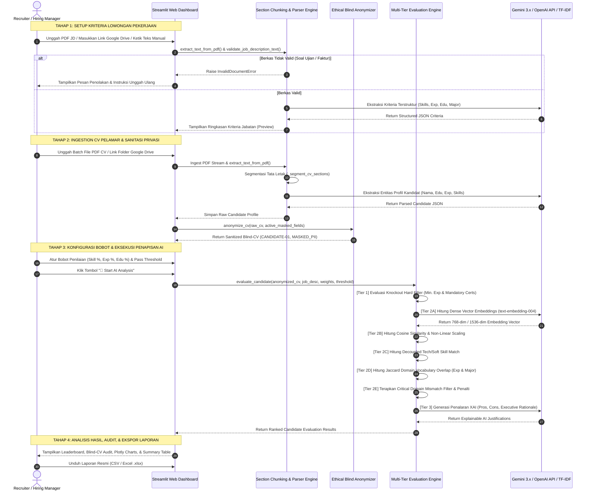

# Product Requirement Document (PRD)
## Autonomous Candidate Screening Platform (TalentAI Engine)

| Metadata | Detail |
| :--- | :--- |
| **Document Title** | Autonomous Candidate Screening Platform — Product Requirement Document |
| **Project Name** | TalentAI Screening & Evaluation Engine |
| **Author** | Reyhan Ezra Bimantara |
| **Target Audience** | Hiring Managers, HR Executives, AI/ML Engineers |
| **Document Version** | v2.3.0 (Production-Ready Architecture) |
| **Repository** | `rrexzra36/Autonomous_Candidate_Screening_Platform` |
| **Last Updated** | 22 Agustus 2026 |

---

## 📑 Daftar Isi (Table of Contents)
1. [Executive Summary & Business Context](#1-executive-summary--business-context)
   - 1.1 Latar Belakang & Problem Statement
   - 1.2 Visi & Nilai Solusi Produk
   - 1.3 Key Performance Indicators (KPIs)
2. [User Personas & End-to-End User Journey](#2-user-personas--end-to-end-user-journey)
   - 2.1 Target User Personas
   - 2.2 End-to-End User Journey Map
3. [System Architecture & Data Engineering](#3-system-architecture--data-engineering)
   - 3.1 Layered Architectural Diagram
   - 3.2 Core Component Breakdown & Responsibilities
   - 3.3 Data Contracts & Schemas
4. [Spesifikasi Algoritma & Formula Penilaian](#4-spesifikasi-algoritma--formula-penilaian)
   - 4.1 Algoritma 1: Layout-Aware Hierarchical Section Chunking
   - 4.2 Algoritma 2: Dense Semantic Vector Embeddings & Cosine Similarity
   - 4.3 Algoritma 3: Multi-Tier Anti-Hallucination Candidate Matching & Domain Scoring
   - 4.4 Algoritma 4: Ethical Blind PII Anonymization Engine (Anti-Bias Shield)
   - 4.5 Algoritma 5: Explainable AI (XAI) Synthesis Engine
5. [Functional Requirements (FRD) & Feature Matrix](#5-functional-requirements-frd--feature-matrix)
   - 5.1 Modul 1: Job Description Ingestion & Validation
   - 5.2 Modul 2: Candidate CV Ingestion & PII Masking
   - 5.3 Modul 3: Multi-Tier Screening & Scoring Execution
   - 5.4 Modul 4: 4-Tab Results Dashboard & Visual Analytics
   - 5.5 Modul 5: Report Export & Audit Trail
6. [User Interface & Dashboard Specifications](#6-user-interface--dashboard-specifications)
   - 6.1 Panel Sidebar & Model Connection
   - 6.2 Step 1 UI: Job Position Criteria Setup
   - 6.3 Step 2 UI: Candidate CV Upload & Blind Anonymization
   - 6.4 Step 3 UI: Scoring Configuration & 4-Tab Dashboard Results
7. [Setup, Deployment & Environment Configuration](#7-setup-deployment--environment-configuration)
8. [Persetujuan & Metadata Dokumen](#8-persetujuan--metadata-dokumen)

---

## 1. Executive Summary & Business Context

### 1.1 Latar Belakang & Problem Statement
Dalam era pertumbuhan organisasi yang pesat dan proses rekrutmen massal (*high-volume rapid hiring*), divisi *Human Resources* (HR) dan *Talent Acquisition* menghadapi tantangan operasional yang berat:
1. **Inefisiensi Waktu & Biaya (Time & Cost Bottleneck):**
   - Rata-rata seorang recruiter membutuhkan **15 hingga 20 menit** untuk membaca, memvalidasi kualifikasi, dan merangkum satu berkas Curriculum Vitae (CV).
   - Untuk 100 pelamar dalam satu posisi lowongan, diperlukan lebih dari **25 hingga 33 jam kerja manual**. Hal ini memicu penumpukan berkas pelamar (*backlog*), memperpanjang *Time-to-Hire*, dan meningkatkan risiko kehilangan kandidat unggul (*talent drop-off*).
2. **Kerentanan Bias Manusia (Subjective & Fatigue Bias):**
   - Penapisan manual rentan terhadap bias subjektif sadar maupun tidak sadar (*unconscious bias*), meliputi bias gender, usia, almamater perguruan tinggi tertentu, foto profil, maupun preferensi format tata letak CV.
   - Fenomena *decision fatigue* terjadi ketika recruiter harus meninjau puluhan CV secara berurutan, menyebabkan inkonsistensi standar penilaian antara kandidat di awal dan akhir antrean.
3. **Kualitas Matching yang Tidak Konsisten & Halusinasi Penilaian:**
   - Pencocokan kualifikasi tradisional berbasis *exact keyword search* (misal: Ctrl+F atau ATS sederhana) sering kali gagal memahami sinonimitas keahlian (misal: *AutoCAD* vs *Technical Drafting*, *Python* vs *Data Automation*) atau sebaliknya, meloloskan kandidat yang memiliki kata kunci umum tetapi bekerja di industri yang sama sekali tidak relevan (*cross-domain mismatch*).
4. **Ketiadaan Transparansi & Explainability:**
   - Sistem *black-box* AI konvensional sering kali hanya memberikan angka skor tanpa justifikasi rasional yang jelas, menyulitkan *Hiring Manager* untuk memahami kekuatan nyata (*Pros*), area pertimbangan (*Cons*), dan alasan objektif penolakan/penerimaan kandidat.

### 1.2 Visi & Nilai Solusi Produk
**TalentAI Engine (Autonomous Candidate Screening Platform)** dirancang sebagai platform penapisan kandidat berbasis **AI/ML end-to-end** yang mengintegrasikan otomasi ekstraksi dokumen, privasi etis tanpa bias, komputasi kemiripan semantik multi-dimensi, validasi relevansi domain secara ketat, serta generasi penalaran AI yang transparan (*Explainable AI*).

```
┌────────────────────────────────────────────────────────────────────────────────────────┐
│                                 NILAI INTI PLATFORM                                    │
├────────────────────────────────────────────────────────────────────────────────────────┤
│  ⚡ KECEPATAN: Memproses ratusan CV dalam hitungan detik (< 2.5 detik per kandidat).   │
│  🛡️ KEADILAN: 100% Blind Screening berbasis kompetensi murni tanpa pengaruh PII.      │
│  🎯 AKURASI: Validasi keahlian teknis & domain pengalaman tanpa halusinasi silang.     │
│  🔍 TRANSPARANSI: Penjelasan XAI (Pros, Cons, Executive Rationale) untuk tiap profil.  │
│  🎛️ KONTROL PENUH: Bobot kriteria dan ambang kelulusan dapat disesuaikan recruiter.    │
└────────────────────────────────────────────────────────────────────────────────────────┘
```

### 1.3 Strategic Objectives & Key Performance Indicators (KPIs)

| Metrik KPI | Target Kuantitatif | Baseline Manual | Manfaat Bisnis |
| :--- | :--- | :--- | :--- |
| **Time-to-Screen** | **< 2.5 detik / CV** | 15–20 menit / CV | Peningkatan efisiensi waktu penapisan hingga **> 95%**. |
| **Cost per Screen** | **Hemat > 75%** | Biaya man-hour tinggi | Pengurangan beban anggaran operasional talent acquisition. |
| **Bias Elimination** | **100% PII Masked** | Sering terpapar PII | Penegakan kepatuhan *Equal Employment Opportunity* (EEO). |
| **Domain Precision** | **> 90% Agreement** | Bervariasi / Subjektif | Kesesuaian rekomendasi AI dengan keputusan akhir *Hiring Manager*. |
| **Document Resilience** | **Zero False-Positive JD** | Rawan salah unggah | Menolak berkas soal ujian, brief teknis, atau faktur secara otomatis. |
| **System Availability** | **100% Uptime (Dual Mode)** | Ketergantungan API | Fallback otomatis ke *Sparse TF-IDF & Offline Rules* saat API offline. |

---

## 2. User Personas & Complete User Journeys

### 2.1 Target User Personas

#### A. Primary Persona: HR Talent Acquisition Specialist (Recruiter)
- **Kebutuhan:** Membuka lowongan baru, mengunggah puluhan hingga ratusan CV pelamar, menyaring kandidat terbaik dalam waktu singkat, dan mengekspor daftar peringkat kandidat (*shortlist*).
- **Pain Point:** Kelelahan memeriksa berkas satu per satu, kesulitan menyeimbangkan bobot kriteria teknis vs pengalaman, dan kekhawatiran adanya bias dalam proses eliminasi awal.
- **Interaksi dengan Sistem:** Mengunggah berkas PDF / Google Drive, mengatur bobot penilaian (*Skill, Experience, Education*), mengatur *Passing Threshold*, dan mengunduh laporan seleksi CSV/Excel.

#### B. Secondary Persona: Hiring Manager / Technical Lead
- **Kebutuhan:** Memastikan kandidat yang diundang ke sesi wawancara memiliki keahlian teknis nyata (*hard skills*) dan pengalaman industri yang relevan secara langsung dengan posisi lowongan.
- **Pain Point:** Sering menerima kandidat *shortlist* dari recruiter yang tidak memiliki keahlian perangkat lunak wajib atau berasal dari latar belakang industri yang tidak cocok (*domain mismatch*).
- **Interaksi dengan Sistem:** Membaca tab *Leaderboard Review*, meninjau visualisasi *Radar Chart*, dan membaca poin-poin XAI (*Pros, Cons, Recommendation Reason*).

#### C. Governance Persona: Diversity, Equity, and Inclusion (DEI) Officer
- **Kebutuhan:** Memastikan proses seleksi awal pelamar bebas dari diskriminasi berbasis gender, usia, asal almamater, ras, atau domisili.
- **Interaksi dengan Sistem:** Mengaudit tab *Blind-CV Anonymization* untuk membandingkan data mentah dengan data tersanitasi yang dievaluasi oleh sistem AI.

#### D. Technical Persona: AI / Systems Administrator
- **Kebutuhan:** Mengonfigurasi model LLM (Google Gemini 3.x / OpenAI GPT-4o), memantau pemakaian kuota API, dan memastikan keandalan fallback offline.

---

### 2.2 End-to-End User Journey Map



---

## 3. System Architecture & Data Engineering

### 3.1 Layered Architectural Diagram

```
┌────────────────────────────────────────────────────────────────────────────────────────┐
│                            PRESENTATION LAYER (STREAMLIT UI)                           │
│  - Step 1: JD Criteria Setup (PDF Upload / Google Drive Ingestion / Text Input)        │
│  - Step 2: Multi-CV Ingestion & Granular PII Blind Masking Controls                    │
│  - Step 3: Dynamic Weight Sliders (Skill %, Exp %, Edu %), Reset, & Anti-Auto-Load     │
│  - 4-Tab Results: Leaderboard, Blind-CV Audit, Plotly Analytics (3 Modes), Summary Tab │
├────────────────────────────────────────────────────────────────────────────────────────┤
│                           ORCHESTRATION & STATE CONTROLLER                             │
│  - Session State Cache (parsed_jd_store, parsed_cv_store, eval_results_store)          │
│  - Execution Signature Validator (executed_config_sig) for Zero-Redundant Execution    │
├────────────────────────────────────────────────────────────────────────────────────────┤
│                       INGESTION & DOCUMENT PROCESSING ENGINE                           │
│  - pypdf Reader & Text Stream Normalizer                                               │
│  - Layout-Aware Hierarchical Section Chunking (_segment_cv_sections)                   │
│  - Strict Document Type Guard (Anti-Test Sheet, Anti-Invoice, Anti-Brief Filter)       │
├────────────────────────────────────────────────────────────────────────────────────────┤
│                       ETHICAL PRIVACY LAYER (BLIND-CV SHIELD)                          │
│  - Granular Field Anonymizer (Name, Email, Phone, Gender, Age, Domicile, University)  │
│  - Deterministic ID Alias Generator (CANDIDATE-01, CANDIDATE-02, ...)                  │
├────────────────────────────────────────────────────────────────────────────────────────┤
│                       MULTI-TIER HYBRID EVALUATION ENGINE                              │
│  - Tier 1: Knockout Rule Checker (Min Experience Years & Mandatory Certifications)     │
│  - Tier 2A: Dense Embedding Engine (Google text-embedding-004 / OpenAI 3-small)       │
│  - Tier 2B: Decoupled Technical & Soft Skill Matcher (75% Hard / 15% Soft / 10% Vec)   │
│  - Tier 2C: Domain Vocabulary Jaccard Overlap & Relevant Experience Calculator         │
│  - Tier 2D: Academic Degree Tier & Major Alignment Matrix                             │
│  - Tier 2E: Critical Cross-Domain Mismatch Capping Filter (Score Cap <= 22% - 28%)     │
├────────────────────────────────────────────────────────────────────────────────────────┤
│                       EXPLAINABLE AI (XAI) REASONING ENGINE                            │
│  - Multi-LLM CoT Reasoner (Gemini 3.x Flash/Pro, OpenAI GPT-4o/GPT-4o-mini)            │
│  - Local Deterministic Rule-Based Fallback Reasoner (100% Offline Capability)          │
├────────────────────────────────────────────────────────────────────────────────────────┤
│                         INTEGRATION & EXPORT CAPABILITIES                             │
│  - Google Drive Importer (gdown Folder & Single File Ingestion via Shared Links)       │
│  - OpenPyXL / Pandas Data Export Engine (Clean CSV & Multi-Cell Styled Excel .xlsx)    │
└────────────────────────────────────────────────────────────────────────────────────────┘
```

---

### 3.2 Core Component Breakdown & Responsibilities

| Modul Berkas | Kelas / Komponen Utama | Tanggung Jawab Utama |
| :--- | :--- | :--- |
| [`src/app.py`](file:///D:/Github/Autonomous_Candidate_Screening_Platform/src/app.py) | `Streamlit App UI` | Mengorkestrasi seluruh alur kerja 3-langkah, mengelola *Session State*, menangani input pengguna, merender visualisasi grafik Plotly, serta menyediakan fitur ekspor berkas. |
| [`src/parser.py`](file:///D:/Github/Autonomous_Candidate_Screening_Platform/src/parser.py) | `DocumentParser` | Mengekstrak teks dari PDF, memvalidasi tipe dokumen (*guard against test sheets*), menjalankan *Hierarchical Section Chunking*, memisahkan *Technical vs Soft Skills*, dan mengekstrak entitas profil. |
| [`src/anonymizer.py`](file:///D:/Github/Autonomous_Candidate_Screening_Platform/src/anonymizer.py) | `BlindCVAnonymizer` | Mengisolasi dan menyamarkan PII sensitif secara granular berdasarkan preferensi recruiter sebelum data dievaluasi oleh engine pencocokan. |
| [`src/matcher.py`](file:///D:/Github/Autonomous_Candidate_Screening_Platform/src/matcher.py) | `CandidateMatcherEngine` | Menjalankan evaluasi 3-Tier: *Knockout Filter*, *Dense Vector Cosine Similarity*, *Decoupled Skills Matching*, *Domain Experience Relevance*, *Major Alignment*, *Mismatch Penalty*, dan *XAI Reasoning Synthesis*. |
| [`src/drive_importer.py`](file:///D:/Github/Autonomous_Candidate_Screening_Platform/src/drive_importer.py) | `GoogleDriveImporter` | Mengunduh berkas PDF tunggal maupun batch multi-file dari folder Google Drive publik ke memori sementara secara aman. |
| [`src/ui_components.py`](file:///D:/Github/Autonomous_Candidate_Screening_Platform/src/ui_components.py) | `loading_screen` | Merender *fullscreen semi-transparent dark backdrop overlay* dengan animasi *circular spinner* modern saat proses asinkron berlangsung. |
| [`src/config.py`](file:///D:/Github/Autonomous_Candidate_Screening_Platform/src/config.py) | `Config` | Membaca variabel lingkungan `.env` secara otomatis dengan fallback parser *native* tanpa dependensi eksternal wajib. |

---

### 3.3 Data Schemas & Data Contracts

#### A. Structured Job Description Schema (`job_desc`)
```json
{
  "$schema": "http://json-schema.org/draft-07/schema#",
  "type": "object",
  "properties": {
    "job_id": { "type": "string", "example": "JOB-UPLOADED-4821" },
    "title": { "type": "string", "example": "Junior Architect" },
    "major": { "type": "string", "example": "Architecture, Interior Design, or a related field" },
    "department": { "type": "string", "example": "Design & Engineering" },
    "hard_requirements": {
      "type": "object",
      "properties": {
        "min_education": { "type": "string", "example": "Bachelor's Degree (S1)" },
        "min_experience_years": { "type": "integer", "example": 2 },
        "mandatory_certifications": { "type": "array", "items": { "type": "string" } }
      },
      "required": ["min_education", "min_experience_years"]
    },
    "technical_skills": { "type": "array", "items": { "type": "string" }, "example": ["AutoCAD", "SketchUp", "Revit", "Technical Drawing"] },
    "soft_skills": { "type": "array", "items": { "type": "string" }, "example": ["Creative & Visualization Skills", "Project Management"] },
    "key_skills": { "type": "array", "items": { "type": "string" } },
    "responsibilities": { "type": "string" },
    "description": { "type": "string" }
  },
  "required": ["job_id", "title", "major", "hard_requirements", "technical_skills", "soft_skills"]
}
```

#### B. Raw Parsed Candidate Profile Schema (`raw_cv`)
```json
{
  "cv_id": "CV-UP-8192",
  "personal_info": {
    "full_name": "Ahmad Fauzi",
    "email": "ahmad.fauzi@email.com",
    "phone": "+6281234567890",
    "gender": "Male",
    "age": 24,
    "photo_url": "",
    "address": "Jakarta Selatan"
  },
  "education": [
    {
      "institution": "Universitas Indonesia",
      "degree": "Bachelor's Degree (S1)",
      "major": "Architecture",
      "period": "2020 - 2024"
    }
  ],
  "work_experience": [
    {
      "role": "Architectural Intern",
      "company": "PT Rancang Bangun Nusantara",
      "duration_years": 2,
      "period": "2022 - 2024",
      "description": "Assisted in architectural drafting, 3D modeling using AutoCAD and SketchUp, and client site visits.",
      "achievements": "Completed drafting for 5 commercial building permits on time."
    }
  ],
  "technical_skills": ["AutoCAD", "SketchUp", "Revit", "Photoshop", "Technical Drawing"],
  "soft_skills": ["Communication Skills", "Teamwork", "Creative & Visualization Skills"],
  "certifications": ["Structural and Architectural Cluster Competency Certification Test"]
}
```

#### C. Anonymized Candidate Profile Schema (`anonymized_cv`)
```json
{
  "cv_id": "CV-UP-8192",
  "is_anonymized": true,
  "personal_info": {
    "candidate_alias": "CANDIDATE-8192",
    "full_name": "CANDIDATE-8192 (Anonymized)",
    "email": "[MASKED_EMAIL@ANONYMIZED.LOCAL]",
    "phone": "[MASKED_PHONE]",
    "gender": "[MASKED_GENDER]",
    "age": "[MASKED_AGE]",
    "photo_url": "",
    "address": "Regional Location (Masked)"
  },
  "education": [
    {
      "institution": "Accredited Higher Education Institution (Masked)",
      "degree": "Bachelor's Degree (S1)",
      "major": "Architecture",
      "period": "2020 - 2024"
    }
  ],
  "work_experience": [ ... ],
  "technical_skills": [ ... ],
  "soft_skills": [ ... ],
  "certifications": [ ... ]
}
```

#### D. Evaluation Result Object Schema (`eval_res`)
```json
{
  "cv_id": "CV-UP-8192",
  "candidate_alias": "CANDIDATE-8192",
  "job_id": "JOB-UPLOADED-4821",
  "job_title": "Junior Architect",
  "overall_score": 88.5,
  "status": "Pass",
  "hard_filter_passed": true,
  "eval_source": "Google Gemini (gemini-3.5-flash)",
  "score_breakdown": {
    "skill_match": 91.2,
    "semantic_similarity": 84.6,
    "experience_depth": 100.0,
    "education": 95.0,
    "education_tier": 95.0
  },
  "matched_skills": ["AutoCAD", "SketchUp", "Revit", "Technical Drawing", "Creative & Visualization Skills"],
  "justification": {
    "pros": [
      "Proficient in essential required technical software: AutoCAD, SketchUp, Revit, and Technical Drawing.",
      "Meets work experience criteria with 2.0 years of relevant domain experience in architectural design.",
      "Holds relevant academic foundation in Architecture from an accredited higher education institution."
    ],
    "cons": [
      "Has not explicitly specified proficiency in Lumion or V-Ray rendering software.",
      "Soft skill adaptability under strict project deadlines requires further confirmation during interview."
    ],
    "recommendation_reason": "Candidate exceeds the qualification threshold (88.5% vs 60.0% min) with proven technical proficiency and directly relevant experience in architectural drafting."
  }
}
```

---

## 4. Spesifikasi Algoritma & Formula Matematis Mendalam

Platform mengintegrasikan 5 algoritma AI/NLP komprehensif:

```
┌────────────────────────────────────────────────────────────────────────────────────────┐
│                        TALENTAI MULTI-TIER EVALUATION ENGINE                           │
├────────────────────────────────────────────────────────────────────────────────────────┤
│  1. HIERARCHICAL SECTION CHUNKING & ISOLATED ENTITY SEGMENTATION                       │
│     Pemartisian layout CV -> [HEADER] | [EXPERIENCE] | [EDUCATION] | [SKILLS]          │
├────────────────────────────────────────────────────────────────────────────────────────┤
│  2. ETHICAL BLIND PII ANONYMIZATION                                                    │
│     Masking: Nama -> CANDIDATE-XX, Phone -> [MASKED], Uni -> ACCREDITED INSTITUTION    │
├────────────────────────────────────────────────────────────────────────────────────────┤
│  3. MULTI-TIER HYBRID SCORING ENGINE                                                   │
│     ├── Tier 1: Knockout Filter (Min. Durasi Pengalaman & Lisensi Wajib)               │
│     ├── Tier 2A: Dense Vector Embedding Cosine Similarity (text-embedding-004)         │
│     ├── Tier 2B: Decoupled Tech/Soft Skill Scoring (Tech 75%, Soft 15%, Vector 10%)    │
│     ├── Tier 2C: Domain Experience Relevance (Jaccard Overlap Token Matching)          │
│     └── Tier 2D: Education Level & Major Alignment Scoring                             │
├────────────────────────────────────────────────────────────────────────────────────────┤
│  4. CRITICAL DOMAIN MISMATCH PENALTY FILTER                                            │
│     0 Tech Match + 0 Relevant Exp -> Cap Skor Overall <= 22% - 28% (Status: Rejected)  │
├────────────────────────────────────────────────────────────────────────────────────────┤
│  5. EXPLAINABLE AI (XAI) REASONING ENGINE                                              │
│     Generasi Natural Language: Strengths (Pros), Gaps (Cons), & Executive Rationale    │
└────────────────────────────────────────────────────────────────────────────────────────┘
```

---

### 4.1 Algoritma 1: Layout-Aware Hierarchical Section Chunking
* **Definisi:** Algoritma segmentasi tata letak dokumen berbasis *Regular Expression Anchors* yang memecah aliran teks kontinu CV ke dalam zona batas terisolasi (`Header`, `Experience`, `Education`, `Skills`, `Certifications`) sebelum ekstraksi entitas dijalankan.
* **Tujuan Teknis:** Menjamin *zero cross-contamination* antar seksi dokumen (misal: nomor kontak pada header tidak terdeteksi sebagai durasi pengalaman kerja).
* **Pola Regex Penanda Zona:**
  - `P_exp` = `(?:WORK EXPERIENCE|PROFESSIONAL EXPERIENCE|EXPERIENCE|PENGALAMAN KERJA)`
  - `P_edu` = `(?:EDUCATION|PENDIDIKAN|RIWAYAT PENDIDIKAN|ACADEMIC BACKGROUND)`
  - `P_skill` = `(?:SKILLS & ABILITIES|TECHNICAL SKILLS|SKILLS|KEAHLIAN|COMPETENCIES)`
  - `P_cert` = `(?:CERTIFICATIONS|CERTIFICATES|SERTIFIKAT|ACHIEVEMENTS)`

---

### 4.2 Algoritma 2: Dense Semantic Vector Embeddings & Non-Linear Cosine Similarity
Transformasi representasi teks lowongan ($\mathbf{u}$) dan profil kandidat ($\mathbf{v}$) ke dalam ruang vektor berdimensi tinggi (*768-dim* pada Google Gemini `text-embedding-004` atau *1536-dim* pada OpenAI `text-embedding-3-small`).

- **Formula Cosine Similarity:**

$$
\cos(\theta) = \frac{\mathbf{u} \cdot \mathbf{v}}{\|\mathbf{u}\|_2 \|\mathbf{v}\|_2} = \frac{\sum_{i=1}^n u_i v_i}{\sqrt{\sum_{i=1}^n u_i^2} \cdot \sqrt{\sum_{i=1}^n v_i^2}}
$$

- **Formula Normalisasi Non-Linear ($S_{\text{semantic}}$):**

$$
S_{\text{semantic}} = \min\left(100.0, \; \max\left(0.0, \; \frac{\cos(\theta) \times 100 - 35.0}{0.55}\right)\right)
$$

---

### 4.3 Algoritma 3: Multi-Tier Anti-Hallucination Candidate Matching & Domain Scoring

#### A. Tier 1: Deterministic Hard Filter (Knockout Criteria)
Tahap validasi syarat mutlak sebelum pembobotan komposit dihitung:

$$
\text{HardFilterPassed} = \left( \sum_{i} \text{Duration}_i \ge \text{MinExp} \right) \land \left( \forall c \in \text{MandatoryCerts}, \; c \in \text{CandidateCerts} \right)
$$

*Jika tidak lolos, kandidat otomatis dikenakan penalti pemotongan skor akhir sebesar **50%**.*

#### B. Tier 2: Perhitungan Komponen Penilaian Terstruktur

##### 1. Parameter Kecocokan Keahlian ($S_{\text{skill}}$) — Decoupled Skills Architecture
Keahlian teknis (*Hard Tools*) dipisahkan secara tegas dari *Soft Skills*:

$$
R_{\text{tech}} = \frac{N_{\text{tech}}}{\max(N_{\text{jd,tech}}, 1)}, \quad R_{\text{soft}} = \frac{N_{\text{soft}}}{\max(N_{\text{jd,soft}}, 1)}
$$

**Aturan Penilaian Keahlian:**

$$
S_{\text{skill}} = 
\begin{cases} 
\min\left(15.0, \; (R_{\text{soft}} \times 10.0) + (S_{\text{semantic}} \times 0.05)\right), & \text{jika } N_{\text{tech}} = 0 \\
(R_{\text{tech}} \times 75.0) + (R_{\text{soft}} \times 15.0) + (\min(100.0, S_{\text{semantic}}) \times 0.10), & \text{jika } N_{\text{tech}} > 0 
\end{cases}
$$

##### 2. Parameter Relevansi Pengalaman Kerja Domain ($S_{\text{exp}}$)
Sistem mengekstrak himpunan kata kunci domain profesi ($D$) dari lowongan kerja dan menghitung durasi relevan:

$$
\text{Years}_{\text{relevant}} = \sum_{i} \left( \text{Duration}_i \times \text{Relevance}_i \right)
$$

$$
S_{\text{exp}} = 
\begin{cases} 
\min\left(100.0, \; \frac{\text{Years}_{\text{relevant}}}{\text{MinExp}} \times 100.0\right), & \text{jika } \text{Years}_{\text{relevant}} > 0 \\
\min\left(10.0, \; \frac{\sum \text{Duration}_i}{\text{MinExp}} \times 10.0\right), & \text{jika } \text{Years}_{\text{relevant}} = 0 
\end{cases}
$$

##### 3. Parameter Pendidikan & Keselarasan Jurusan ($S_{\text{edu}}$)

$$
S_{\text{edu}} = (S_{\text{deg}} \times 0.40) + (S_{\text{major}} \times 0.60)
$$

- **Skor Jenjang ($S_{\text{deg}}$):** S2/Master = 100.0, S1/Bachelor = 90.0, D3/Diploma = 80.0, Jenjang lebih rendah = 45.0–50.0.
- **Skor Keselarasan Jurusan ($S_{\text{major}}$):**
  - Jurusan Selaras Sempurna (misal: *Teknik Arsitektur*): **95.0**
  - Rumpun Teknik Terkait / Engineering (misal: *Teknik Sipil*): **65.0**
  - Rumpun Desain/Bangunan Terkait (misal: *Desain Interior*): **55.0**
  - Jurusan Lintas Disiplin / Tidak Relevan: **20.0**

#### C. Pembobotan Komposit & Penalti Mismatch Kritis
Skor mentah dihitung berdasarkan bobot dinamis:

$$
S_{\text{raw}} = (S_{\text{skill}} \times W_{\text{skill}}) + (S_{\text{exp}} \times W_{\text{exp}}) + (S_{\text{edu}} \times W_{\text{edu}})
$$

$$
W_{\text{skill}} = 0.50, \quad W_{\text{exp}} = 0.30, \quad W_{\text{edu}} = 0.20 \quad \text{(Bobot Standar Default)}
$$

**Critical Cross-Domain Mismatch Capping Filter:**
Jika kandidat memiliki **0 technical skill relevan** DAN **0 tahun pengalaman kerja relevan**:

$$
S_{\text{overall}} = 
\begin{cases} 
\min(22.0, \; S_{\text{raw}}), & \text{jika } S_{\text{major}} \le 50.0 \text{ (Jurusan berbeda total)} \\
\min(28.0, \; S_{\text{raw}}), & \text{jika } S_{\text{major}} > 50.0 \\
S_{\text{raw}}, & \text{kandidat dalam domain relevan}
\end{cases}
$$

#### D. Klasifikasi Keputusan Rekomendasi

$$
\text{Status} = 
\begin{cases} 
\mathbf{Pass}, & \text{jika } S_{\text{overall}} \ge \text{Threshold} \land \text{HardFilterPassed} \\
\mathbf{Considered}, & \text{jika } S_{\text{overall}} \ge \max(\text{Threshold} - 15.0, \; 45.0) \\
\mathbf{Rejected}, & \text{lainnya}
\end{cases}
$$

---

### 4.4 Algoritma 4: Ethical Blind PII Anonymization Engine (Anti-Bias Shield)
* **Tujuan:** Menjamin kepatuhan terhadap standar *Equal Employment Opportunity* (EEO) dan regulasi perlindungan data pribadi (UU PDP Indonesia / GDPR).
* **Matriks Transformasi Sanitasi Data:**

| Data Field | Nilai Mentah (Raw) | Transformasi Sanitasi (Blind-CV) | Alasan Perlindungan |
| :--- | :--- | :--- | :--- |
| `full_name` | "Ahmad Fauzi" | `CANDIDATE-8192 (Anonymized)` | Menghilangkan bias etnis, ras, dan gender nama. |
| `email` | "ahmad.fauzi@email.com" | `[MASKED_EMAIL@ANONYMIZED.LOCAL]` | Mencegah pelacakan identitas digital langsung. |
| `phone` | "+6281234567890" | `[MASKED_PHONE]` | Perlindungan kontak pribadi. |
| `gender` | "Male" / "Laki-laki" | `[MASKED_GENDER]` | Eliminasi total bias berbasis gender. |
| `age` | 24 | `[MASKED_AGE]` | Eliminasi bias berbasis umur (*ageism*). |
| `photo_url` | "https://.../photo.jpg" | `""` (Dihapus) | Eliminasi bias penampilan fisik (*lookism*). |
| `address` | "Jl. Sudirman No. 12, Jakarta" | `Regional Location (Masked)` | Menghilangkan diskriminasi zonasi domisili. |
| `university` | "Universitas Indonesia" | `Accredited Higher Education Institution` | Menilai akreditasi tanpa bias gengsi almamater. |

---

### 4.5 Algoritma 5: Explainable AI (XAI) & Chain-of-Thought (CoT) Synthesis
* **Definisi:** Engine sintesis penalaran kualitatif berbasis LLM Prompting dengan *Chain-of-Thought* (CoT) terstruktur atau *Deterministic Rule Engine Fallback*.
* **Struktur Output XAI (3 Dimensi):**
  1. **Profile Strengths (Pros):** Menjelaskan keahlian perangkat lunak terverifikasi, durasi pengalaman kerja relevan, dan kualifikasi akademik yang memenuhi syarat.
  2. **Areas for Consideration / Gaps (Cons):** Mengidentifikasi *tools* wajib yang belum dicantumkan, gap pengalaman kerja, atau ketidaksesuaian domain profesi secara eksplisit.
  3. **Executive Status Explanation (Decision Rationale):** Justifikasi bisnis padat 1–2 kalimat yang menjelaskan *mengapa* kandidat memperoleh status *Pass / Considered / Rejected* terhadap ambang batas kelulusan.

---

## 5. Functional Requirements (FRD) & Feature Matrix

### 5.1 Modul 1: Job Description Ingestion & Validation
* **FR-01 (Multi-Source Input):** Sistem harus mendukung 3 moda input kriteria jabatan: (1) Unggah berkas PDF, (2) Impor tautan Google Drive publik, dan (3) Pengetikan teks langsung.
* **FR-02 (Document Guard & Validation):** Sistem harus menolak berkas yang bukan merupakan dokumen lowongan kerja resmi (seperti lembar soal ujian teknis, faktur, purchase order, atau teks umum) dengan menampilkan pesan peringatan yang jelas.
* **FR-03 (Structured Criteria Extraction):** Sistem harus mengekstrak jabatan (*title*), jurusan yang dipersyaratkan (*major*), tingkat pendidikan minimal, pengalaman kerja minimal, daftar keahlian teknis (*technical skills*), dan keahlian interpersonal (*soft skills*).
* **FR-04 (Preview Criteria Card):** Sistem harus menampilkan kartu ringkasan kriteria jabatan teridentifikasi sebelum pengguna beralih ke tahap berikutnya.

### 5.2 Modul 2: Candidate CV Ingestion & PII Masking
* **FR-05 (Batch PDF Upload):** Sistem harus mampu menerima berkas PDF CV dalam jumlah banyak sekaligus (*multi-file batch upload* hingga 200MB).
* **FR-06 (Google Drive Folder Ingestion):** Sistem harus mampu mengunduh seluruh berkas PDF yang berada di dalam folder Google Drive publik menggunakan modul `gdown`.
* **FR-07 (Granular PII Blind Masking):** Pengguna dapat memilih field data pribadi apa saja yang ingin disamarkan (Nama, Email, Telepon, Gender, Usia, Domisili, Foto, Nama Kampus) dengan tombol toggle *Blind-CV Anonymization*.
* **FR-08 (Individual CV Deletion):** Pengguna dapat menghapus berkas CV tertentu dari daftar antrean tanpa mereset seluruh sesi.

### 5.3 Modul 3: Multi-Tier Screening & Scoring Execution
* **FR-09 (Dynamic Weight Adjustment):** Pengguna dapat menyesuaikan bobot persentase penilaian: Skill Match (%), Experience Depth (%), dan Education (%) serta menentukan nilai ambang kelulusan *Pass Threshold (%)*.
* **FR-10 (Total Weight Validator):** Sistem memvalidasi bahwa total penjumlahan ketiga bobot harus tepat 100%. Tombol eksekusi dinonaktifkan jika total bobot tidak sama dengan 100%.
* **FR-11 (Reset Weights Action):** Tersedia tombol **🔄 Reset Weights** untuk mengembalikan konfigurasi bobot ke standar default (Threshold 60%, Skill 50%, Exp 30%, Edu 20%).
* **FR-12 (Anti-Auto-Load Protection):** Analisis penilaian AI hanya akan dieksekusi jika pengguna secara eksplisit menekan tombol **🚀 Start AI Analysis**. Perubahan slider bobot tidak akan memicu komputasi ulang otomatis yang tidak disengaja.

### 5.4 Modul 4: 4-Tab Results Dashboard & Visual Analytics
* **FR-13 (Tab 1 — Ranked Leaderboard):** Menampilkan metrik eksekutif (*Total Processed, Shortlisted Count, Average Score*) dan kartu profil kandidat terurut dari skor tertinggi ke terendah dengan badge status (*Pass / Considered / Rejected*) dan ekspander ulasan mendalam.
* **FR-14 (Tab 2 — Blind-CV Audit Inspector):** Menyediakan dropdown pemilih CV untuk membandingkan secara berdampingan data mentah (*Raw CV JSON*) dengan data tersanitasi (*Blind-CV JSON*) yang diproses oleh AI.
* **FR-15 (Tab 3 — Interactive Plotly Analytics):** Menyediakan 3 moda visualisasi data interaktif berskala 0–100%:
  - *Stacked Composite Contribution:* Visualisasi kontribusi nilai terbobot Skill, Exp, dan Edu terhadap Overall Match Score dengan garis penanda *Pass Threshold*.
  - *Grouped Multi-Metric Comparison:* Perbandingan batang berdampingan untuk tiap metrik evaluasi per kandidat.
  - *Competency Radar Analysis:* Grafik radar jaring laba-laba untuk menganalisis dimensi kompetensi 5 kandidat teratas.
* **FR-16 (Tab 4 — Summary Table):** Menampilkan tabel ringkasan evaluasi seluruh kandidat lengkap dengan pewarnaan sel status (*Green: Pass, Yellow: Considered, Red: Rejected*).

### 5.5 Modul 5: Report Export & Audit Trail
* **FR-17 (CSV Export):** Pengguna dapat mengunduh seluruh baris data ringkasan evaluasi ke format CSV standar UTF-8.
* **FR-18 (Excel .xlsx Export):** Pengguna dapat mengunduh berkas spreadsheet Microsoft Excel (`.xlsx`) lengkap dengan nama kolom rapi dan format nilai persentase menggunakan engine `openpyxl`.
* **FR-19 (Status Filtering for Export):** Pengguna dapat memfilter data yang ingin diekspor berdasarkan status: *All Statuses, Pass Only, Considered Only, atau Rejected Only*.

---

## 6. User Interface & Dashboard Specifications

### 6.1 Panel Sidebar & Model Connection
* **AI Provider Selector:** Pilihan dropdown antara *Google Gemini* dan *OpenAI*.
* **Model Dropdown:**
  - *Gemini:* `gemini-3.1-pro-preview`, `gemini-3.5-flash`, `gemini-3-flash-preview`, `gemini-3.1-flash-lite`, atau `Input Custom Model (Manual)`.
  - *OpenAI:* `gpt-4o-mini`, `gpt-4o`, `gpt-4-turbo`, `gpt-3.5-turbo`.
* **API Key Input & Status:** Kolom input password dengan tombol **🔗 Connect to Model** dan **🔌 Disconnect**.

### 6.2 Step 1 UI: Job Position Criteria Setup
* Tab Navigasi: `PDF Upload`, `Import Google Drive`, `Type Text`.
* Baris Header: Label judul sejajar dengan tombol **`Reset`** dan tombol utama **`Preview Job Criteria`**.
* Kartu Ekspander: Menampilkan rincian kriteria jabatan teridentifikasi (*Position, Major, Education, Experience, Technical Skills, Soft Skills, Responsibilities*).

### 6.3 Step 2 UI: Candidate CV Upload & Blind Anonymization
* **Container Blind-CV:** Toggle sakelar *Blind-CV Anonymization* disertai 8 checkbox PII (*Full Name, Email, Phone, Gender, Age, Domicile, Profile Photo, University*).
* Tab Navigasi: `PDF Upload` (Multi-file drag & drop) dan `Import Google Drive` (Folder link importer dengan daftar preview file & tombol `✖`).
* Indikator Status: Menampilkan badge jumlah total berkas CV yang siap dinilai.

### 6.4 Step 3 UI: Scoring Configuration & 4-Tab Dashboard Results
* Baris Pengaturan: Slider numerik *Threshold (%)*, *Skill Match (%)*, *Experience Depth (%)*, dan *Education (%)*.
* Tombol Pengendali: Tombol **`Reset Weights`** dan tombol aksi **`Start AI Analysis`**.
* **4-Tab Navigation View:**
  1. **Leaderboard & Screening Results:** Ringkasan metrik 3 kartu dan kartu profil terurut dengan rincian XAI (*Pros, Cons, Decision Rationale*).
  2. **Blind-CV Anonymization:** Dropdown pemilih CV dengan tampilan perbandingan JSON berdampingan (*Raw vs Sanitized*).
  3. **Analytics & Distribution:** 4 kartu metrik analitik, radio button pemilih moda grafik (*Stacked, Grouped, Radar*), dan grafik interaktif Plotly berskala 0–100%.
  4. **Summary:** Dropdown filter status, tombol ekspor CSV, tombol ekspor Excel (.xlsx), dan tabel interaktif dengan styling warna status.

---

## 7. Setup, Deployment & Environment Configuration

### 7.1 Persyaratan Sistem
- **Python:** Versi 3.10, 3.11, atau 3.12.
- **Sistem Operasi:** Windows 10/11, macOS, atau Linux (Ubuntu 20.04+).
- **Koneksi Jaringan:** Akses internet untuk integrasi Gemini/OpenAI API atau Google Drive Importer (Opsional untuk mode offline).

### 7.2 Instalasi & Menjalankan Aplikasi
```bash
# 1. Kloning Repositori
git clone https://github.com/rrexzra36/Autonomous_Candidate_Screening_Platform.git
cd Autonomous_Candidate_Screening_Platform

# 2. Buat & Aktifkan Virtual Environment
python -m venv venv
# Windows:
.\venv\Scripts\activate
# Linux/macOS:
source venv/bin/activate

# 3. Instal Dependensi
pip install -r requirements.txt

# 4. Konfigurasi Variabel Lingkungan (Opsional)
cp .env.example .env

# 5. Jalankan Dashboard Streamlit
streamlit run src/app.py
```

---

## 8. Persetujuan & Metadata Dokumen
* **Author:** Reyhan Ezra Bimantara
* **Repository:** `rrexzra36/Autonomous_Candidate_Screening_Platform`
