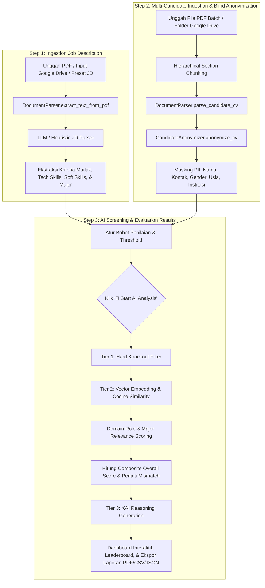

# 🤖 Autonomous Candidate Screening Platform (TalentAI Engine)

> **AI Specialist Technical Assessment Solution**  
> Platform penapisan dan seleksi CV kandidat otomatis berbasis AI/ML end-to-end dengan sistem **Ethical Blind Anonymization**, **Hierarchical Section Chunking**, **Dense Semantic Vector Embeddings**, **Anti-Hallucination Domain Scoring Engine**, dan **Explainable AI (XAI)**.

---

## 📑 Daftar Isi
1. [Ringkasan Platform](#-ringkasan-platform)
2. [Alur Kerja Aplikasi (End-to-End Application Flow)](#-alur-kerja-aplikasi-end-to-end-application-flow)
3. [Arsitektur Algoritma & Formula Perhitungan Matematis](#-arsitektur-algoritma--formula-perhitungan-matematis)
   - [1. Hierarchical Section Chunking & Isolated Named Entity Segmentation](#1-hierarchical-section-chunking--isolated-named-entity-segmentation)
   - [2. Dense Semantic Vector Embeddings & Cosine Similarity](#2-dense-semantic-vector-embeddings--cosine-similarity)
   - [3. Multi-Tier Anti-Hallucination Candidate Matching & Domain Scoring](#3-multi-tier-anti-hallucination-candidate-matching--domain-scoring)
   - [4. Dynamic Anonymization & PII Masking Engine (Ethical Shield)](#4-dynamic-anonymization--pii-masking-engine-ethical-shield)
   - [5. Explainable AI (XAI) & Structured Reasoning Generation](#5-explainable-ai-xai--structured-reasoning-generation)
4. [Tech Stack yang Digunakan](#-tech-stack-yang-digunakan)
5. [Struktur Repositori](#-struktur-repositori)
6. [Panduan Instalasi & Menjalankan Aplikasi](#-panduan-instalasi--menjalankan-aplikasi)

---

## 🌟 Ringkasan Platform

Autonomous Candidate Screening Platform dirancang untuk mengatasi inefisiensi dan bias pada proses rekrutmen massal (*high-volume hiring*). Platform ini mampu menganalisis ratusan CV dalam hitungan detik, mencocokkan kualifikasi secara mendalam (*lexical & semantic*), serta menyajikan laporan penapisan transparan yang dapat dipertanggungjawabkan kepada *Hiring Manager*.

### Fitur Utama:
- 🛡️ **Ethical Blind Screening:** Sensor otomatis terhadap PII (*Personally Identifiable Information*) seperti Nama, Foto, Gender, Umur, Alamat, dan Institusi untuk menjamin penilaian objektif berbasis kompetensi murni.
- 🧩 **Hierarchical Section Chunking:** Pemartisian cerdas tata letak CV ke dalam seksi terisolasi (*Header, Experience, Education, Skills*) untuk mencegah kontaminasi silang entitas.
- ⚡ **Dense Semantic Vector Embeddings:** Penilaian kecocokan semantik kontekstual menggunakan representasi vektor berdimensi tinggi (`text-embedding-004` / `text-embedding-3-small`).
- 🎯 **Domain Role Validation & Anti-Hallucination Filter:** Memvalidasi relevansi pengalaman kerja dan kesesuaian rumpun jurusan secara ketat untuk mencegah kandidat lintas domain memperoleh skor tinggi.
- 📊 **Explainable AI (XAI):** Rincian skor komprehensif, analisis Kekuatan (*Pros*), Area Pertimbangan (*Cons*), dan Rekomendasi Pertanyaan Wawancara terarah.
- 🎛️ **Kontrol Eksekusi Manual & Bobot Dinamis:** Bobot penilaian (*Skill, Experience, Education*) dan ambang kelulusan (*Threshold*) dapat disesuaikan secara fleksibel dengan tombol *Reset Weights* serta proteksi *Anti-Auto-Load*.

---

## 🔄 Alur Kerja Aplikasi (End-to-End Application Flow)

Aplikasi berjalan melalui 3 tahapan (*3-Step Structured Workflow*) pada antarmuka Streamlit:



### Penjelasan Tahapan Pengguna:
1. **Step 1 — Setup Job Description:**
   - Pengguna memilih lowongan preset (*Junior Architect, Drafter, QA Engineer, dll.*), mengunggah berkas PDF JD, atau memasukkan tautan Google Drive publik.
   - Sistem memvalidasi keaslian berkas JD (menolak lembar tes/faktur) dan mengekstrak kriteria secara terstruktur (*Hard Requirements, Technical Skills, Soft Skills, Major*).
2. **Step 2 — Ingestion CV Kandidat & Blind Anonymization:**
   - Pengguna mengunggah berkas-berkas CV pelamar (PDF) atau memasukkan tautan folder Google Drive.
   - Algoritma *Hierarchical Section Chunking* membaca dokumen tanpa kontaminasi silang.
   - *Anonymizer Engine* menyamarkan data sensitif menjadi alias unik (`CANDIDATE-01`, `CANDIDATE-02`, dst.).
3. **Step 3 — AI Screening & Interactive Evaluation:**
   - Pengguna mengatur ambang batas kelulusan (*Pass Threshold*) dan bobot penilaian (*Skill, Experience, Education*). Terdapat tombol **🔄 Reset Weights** untuk kembali ke rasio standar (50:30:20).
   - Pengguna menekan tombol **🚀 Start AI Analysis** untuk memulai komputasi (dilengkapi proteksi *Anti-Auto-Load* agar analisis tidak berjalan berulang secara tidak disengaja).
   - Menampilkan *Executive Summary Metrics*, Tabel *Leaderboard*, Distribusi Skor *Plotly*, Analisis XAI Mendalam (*Pros, Cons, Rationale*), dan Fitur Ekspor Laporan (*CSV, JSON, PDF*).

---

## 🧠 Arsitektur Algoritma & Formula Perhitungan Matematis

Platform ini menggabungkan 5 algoritma AI/NLP untuk menghasilkan penilaian yang presisi, adil, dan transparan:

```
┌────────────────────────────────────────────────────────────────────────────────────────┐
│                        TALENTAI MULTI-TIER EVALUATION ENGINE                           │
├────────────────────────────────────────────────────────────────────────────────────────┤
│  1. HIERARCHICAL SECTION CHUNKING & ISOLATED ENTITY SEGMENTATION                       │
│     Pemartisian layout CV -> [HEADER] | [EXPERIENCE] | [EDUCATION] | [SKILLS]          │
├────────────────────────────────────────────────────────────────────────────────────────┤
│  2. ETHICAL BLIND PII ANONYMIZATION                                                    │
│     Masking: Nama -> CANDIDATE-XX, Phone -> [MASKED], Uni -> ACCREDITED INSTITUTION    │
├────────────────────────────────────────────────────────────────────────────────────────┤
│  3. MULTI-TIER HYBRID SCORING ENGINE                                                   │
│     ├── Tier 1: Knockout Filter (Min. Durasi Pengalaman & Lisensi Wajib)               │
│     ├── Tier 2A: Dense Vector Embedding Cosine Similarity (text-embedding-004)         │
│     ├── Tier 2B: Decoupled Tech/Soft Skill Scoring (Tech 75%, Soft 15%, Vector 10%)    │
│     ├── Tier 2C: Domain Experience Relevance (Jaccard Overlap Token Matching)          │
│     └── Tier 2D: Education Level & Major Alignment Scoring                             │
├────────────────────────────────────────────────────────────────────────────────────────┤
│  4. CRITICAL DOMAIN MISMATCH PENALTY FILTER                                            │
│     0 Tech Match + 0 Relevant Exp -> Cap Skor Overall <= 22% - 28% (Status: Rejected)  │
├────────────────────────────────────────────────────────────────────────────────────────┤
│  5. EXPLAINABLE AI (XAI) REASONING ENGINE                                              │
│     Generasi Natural Language: Strengths (Pros), Gaps (Cons), & Executive Rationale    │
└────────────────────────────────────────────────────────────────────────────────────────┘
```

---

### 1. Hierarchical Section Chunking & Isolated Named Entity Segmentation
* **Pengertian:** Algoritma pemartisian dokumen berbasis *Rule-Based NLP Layout-Aware Segmentation* yang memotong teks CV ke dalam blok-blok semantik terisolasi sebelum ekstraksi entitas dilakukan.
* **Tujuan:** Mencegah terjadinya *cross-contamination* (misal: biodata kontak tidak sengaja terbaca sebagai pencapaian kerja, atau kata umum terpotong menjadi nama institusi palsu).
* **Mekanisme:**
  $$\text{CV Raw Text} \xrightarrow{\text{Regex Anchor}} \Big\{ \mathcal{S}_{\text{Header}}, \; \mathcal{S}_{\text{Experience}}, \; \mathcal{S}_{\text{Education}}, \; \mathcal{S}_{\text{Skills}}, \; \mathcal{S}_{\text{Certifications}} \Big\}$$
  - $\mathcal{S}_{\text{Header}}$: Ekstraksi Nama, Email, Telepon, dan Lokasi Domisili.
  - $\mathcal{S}_{\text{Experience}}$: Ekstraksi Jabatan (*Role*), Nama Perusahaan (*Company*), Durasi, dan Poin Tugas (*Achievements*).
  - $\mathcal{S}_{\text{Education}}$: Ekstraksi Nama Perguruan Tinggi, Jenjang (S1/D3/S2), Jurusan (*Major*), dan Periode Studi.
  - $\mathcal{S}_{\text{Skills}}$: Ekstraksi *Technical Tools* dan *Soft Skills*.

---

### 2. Dense Semantic Vector Embeddings & Cosine Similarity
* **Pengertian:** Pemetaan representasi teks profil lowongan kerja ($\mathbf{u}$) dan profil kandidat ($\mathbf{v}$) ke dalam ruang vektor berdimensi tinggi (*768-dim* pada Google Gemini `text-embedding-004` atau *1536-dim* pada OpenAI `text-embedding-3-small`).
* **Formula Perhitungan Cosine Similarity:**
  $$\text{Cosine Similarity} = \cos(\theta) = \frac{\mathbf{u} \cdot \mathbf{v}}{\|\mathbf{u}\|_2 \|\mathbf{v}\|_2} = \frac{\sum_{i=1}^n u_i v_i}{\sqrt{\sum_{i=1}^n u_i^2} \cdot \sqrt{\sum_{i=1}^n v_i^2}}$$
* **Formula Normalisasi Skor Semantik ($S_{\text{semantic}}$):**
  Untuk memetakan nilai *cosine similarity* (umumnya bernilai $0.35 - 0.90$) ke dalam skala persentase $0 - 100\%$:
  $$S_{\text{semantic}} = \min\left(100.0, \; \max\left(0.0, \; \frac{\cos(\theta) \times 100 - 35.0}{0.55}\right)\right)$$

---

### 3. Multi-Tier Anti-Hallucination Candidate Matching & Domain Scoring

#### A. Tier 1: Hard Filter (Knockout Criteria)
Memvalidasi syarat mutlak sebelum penilaian komposit:
$$\text{HardFilterPassed} = \left( \sum_{i} \text{Duration}_i \ge \text{MinExp} \right) \land \left( \forall c \in \text{MandatoryCerts}, \; c \in \text{CandidateCerts} \right)$$
Jika gagal, kandidat mendapatkan penalti pemotongan skor akhir sebesar $50\%$.

#### B. Tier 2: Perhitungan Komponen Penilaian

##### 1. Parameter Skill Compatibility ($S_{\text{skill}}$)
Keahlian teknis (*Hard Skills*) dipisahkan dari *Soft Skills* untuk mencegah kandidat tanpa keahlian inti lolos seleksi:
- Rasio Kecocokan Teknis: $R_{\text{tech}} = \frac{N_{\text{matched\_tech}}}{\max(N_{\text{jd\_tech}}, 1)}$
- Rasio Kecocokan *Soft Skills*: $R_{\text{soft}} = \frac{N_{\text{matched\_soft}}}{\max(N_{\text{jd\_soft}}, 1)}$

**Formula Penilaian Skill:**
$$S_{\text{skill}} = 
\begin{cases} 
\min\Big(15.0, \; (R_{\text{soft}} \times 10.0) + (S_{\text{semantic}} \times 0.05)\Big), & \text{jika } N_{\text{matched\_tech}} = 0 \\
(R_{\text{tech}} \times 75.0) + (R_{\text{soft}} \times 15.0) + (\min(100, S_{\text{semantic}}) \times 0.10), & \text{jika } N_{\text{matched\_tech}} > 0 
\end{cases}$$

##### 2. Parameter Work Experience Domain Relevance ($S_{\text{exp}}$)
Sistem mengekstrak kata kunci domain profesi ($\mathcal{D}$) dari lowongan kerja dan menghitung relevansi tiap entri riwayat kerja kandidat menggunakan token overlap:
$$\text{Relevance}_i = 
\begin{cases} 
1.0, & \text{jika } \text{Overlap}(\text{Role}_i, \mathcal{D}) \ge 0.12 \lor \text{HasTechSkill}_i \\
0.5, & \text{jika } \text{Overlap}(\text{Role}_i, \mathcal{D}) > 0.04 \\
0.0, & \text{lainnya (tidak relevan)}
\end{cases}$$

$$\text{Years}_{\text{relevant}} = \sum_{i} \left( \text{Duration}_i \times \text{Relevance}_i \right)$$

**Formula Skor Pengalaman:**
$$S_{\text{exp}} = 
\begin{cases} 
\min\left(100.0, \; \frac{\text{Years}_{\text{relevant}}}{\text{MinExp}} \times 100.0\right), & \text{jika } \text{Years}_{\text{relevant}} > 0 \\
\min\left(10.0, \; \frac{\sum \text{Duration}_i}{\text{MinExp}} \times 10.0\right), & \text{jika } \text{Years}_{\text{relevant}} = 0 \text{ (hanya poin transfer)}
\end{cases}$$

##### 3. Parameter Education & Major Relevance ($S_{\text{edu}}$)
$$S_{\text{edu}} = (S_{\text{deg\_level}} \times 0.40) + (S_{\text{major\_relevance}} \times 0.60)$$
- $S_{\text{deg\_level}} \in [45.0, 100.0]$ (berdasarkan pemenuhan jenjang S1/D3/S2).
- $S_{\text{major\_relevance}} \in [20.0, 95.0]$ (berdasarkan kedekatan rumpun jurusan dengan posisi).

#### C. Pembobotan Komposit & Penalti Mismatch Kritis
Skor mentah dihitung berdasarkan bobot dinamis ($W_{\text{skill}}, W_{\text{exp}}, W_{\text{edu}}$):
$$S_{\text{raw}} = (S_{\text{skill}} \times W_{\text{skill}}) + (S_{\text{exp}} \times W_{\text{exp}}) + (S_{\text{edu}} \times W_{\text{edu}})$$

**Critical Domain Mismatch Filter:**
Jika kandidat memiliki **0 technical skill relevan** DAN **0 tahun pengalaman kerja relevan**:
$$S_{\text{overall}} = 
\begin{cases} 
\min(22.0, \; S_{\text{raw}}), & \text{jika } S_{\text{major}} \le 50.0 \text{ (Jurusan berbeda)} \\
\min(28.0, \; S_{\text{raw}}), & \text{jika } S_{\text{major}} > 50.0 \\
S_{\text{raw}}, & \text{kandidat dalam domain}
\end{cases}$$

Jika $\neg \text{HardFilterPassed}$, maka: $S_{\text{overall}} = S_{\text{overall}} \times 0.5$.

#### D. Klasifikasi Rekomendasi Akhir
$$\text{Status} = 
\begin{cases} 
\mathbf{Pass}, & \text{jika } S_{\text{overall}} \ge \text{Threshold} \land \text{HardFilterPassed} \\
\mathbf{Considered}, & \text{jika } S_{\text{overall}} \ge \max(\text{Threshold} - 15.0, \; 45.0) \\
\mathbf{Rejected}, & \text{lainnya}
\end{cases}$$

---

### 4. Dynamic Anonymization & PII Masking Engine (Ethical Shield)
* **Pengertian:** Algoritma sanitasi data pribadi untuk menjamin *Equal Employment Opportunity* (EEO).
* **Target Masking:**
  - `full_name` $\to$ `CANDIDATE-01`
  - `email` $\to$ `candidate-01@screening.local`
  - `phone` $\to$ `+628**********`
  - `gender` & `age` $\to$ `[REDACTED FOR SCREENING]`
  - `address` $\to$ `[REGIONAL LEVEL]`
  - `institution` $\to$ `Accredited Higher Education Institution`

---

### 5. Explainable AI (XAI) & Structured Reasoning Generation
* **Pengertian:** Engine inferensi (berbasis LLM CoT atau Rule-Based Fallback) yang menghasilkan penjelasan kualitatif terstruktur:
  - **Profile Strengths (Pros):** Menjelaskan keahlian teknis spesifik, durasi pengalaman relevan, dan kualifikasi pendidikan yang terpenuhi.
  - **Areas for Consideration (Cons):** Mendeteksi kekurangan alat kerja spesifik, gap pengalaman, atau ketidaksesuaian domain profesi.
  - **Executive Decision Rationale:** Memberikan justifikasi bisnis yang jelas atas status `Pass`, `Considered`, atau `Rejected`.

---

## 🛠️ Tech Stack yang Digunakan

| Kategori | Teknologi / Library | Fungsi Utama |
| :--- | :--- | :--- |
| **Frontend UI & Visualisasi** | `Streamlit` (v1.30+) | Antarmuka dashboard rekrutmen interaktif, responsif, dan berbasis komponen. |
| | `Plotly` (`plotly.express`, `graph_objects`) | Visualisasi distribusi skor, radar chart kompetensi, dan bar ranking kandidat. |
| | `Pandas` | Manipulasi tabel leaderboard, agregasi data penilaian, dan ekspor CSV. |
| **NLP & Document Parsing** | `PyPDF` (`pypdf`) | Ekstraksi teks digital dari berkas PDF Job Description & CV pelamar. |
| | `Regular Expressions (re)` | Hierarchical Section Chunking, Token Normalization, & PII Sanitizer. |
| **AI Models & LLM Framework** | `google-genai` / `google.generativeai` | Google Gemini (`gemini-2.5-flash`, `gemini-3.x`, `text-embedding-004`). |
| | `openai` | OpenAI SDK (`gpt-4o-mini`, `gpt-4o`, `text-embedding-3-small`). |
| **Offline Fallback Engine** | Sparse TF-IDF Term Vectorizer | Ekstraksi fitur teks dan komputasi cosine similarity saat mode offline/tanpa token API. |
| | Rule-Based XAI Reasoner | Engine sintesis Pros/Cons dan Executive Rationale tanpa dependensi eksternal. |
| **Integrasi & Utilitas** | `requests`, `gdown` | Pengunduhan otomatis berkas PDF/Folder dari tautan publik Google Drive. |
| | `Report Generator (HTML/CSS/Print)` | Pencetakan berkas laporan seleksi resmi (*PDF & JSON format*). |

---

## 🗂️ Struktur Repositori

```
Autonomous_Candidate_Screening_Platform/
├── .streamlit/
│   └── config.toml                  # Konfigurasi batas upload (200MB) & sesi WebSocket
├── sample_data/
│   ├── job_descriptions.json        # Dataset kriteria lowongan acuan (Arsitektur & Manufaktur)
│   └── sample_cvs.json              # Dataset acuan profil CV kandidat terstruktur
├── src/
│   ├── __init__.py
│   ├── anonymizer.py                # Ethical PII Masking & Blind-CV Engine
│   ├── parser.py                    # Multi-Modal PDF Parser & Section Chunking Algorithm
│   ├── matcher.py                   # 3-Tier Scoring, Vector Embeddings, & Domain Validation Engine
│   └── app.py                       # Interactive Streamlit Web Application Dashboard
├── .env.example                     # Template variabel lingkungan API Key
├── PRD.md                           # Product Requirement Document (PRD) Komprehensif
├── Presentation_Deck.md             # Format Slide Presentasi Teknis Proyek
├── README.md                        # Panduan Teknis & Dokumentasi Proyek
└── requirements.txt                 # Daftar Dependensi Python
```

---

## 🚀 Panduan Instalasi & Menjalankan Aplikasi

### 1. Kloning Repositori & Persiapan Lingkungan
```bash
git clone https://github.com/rrexzra36/Autonomous_Candidate_Screening_Platform.git
cd Autonomous_Candidate_Screening_Platform
```

### 2. Buat Virtual Environment & Install Dependensi
```bash
# Menggunakan Python 3.10, 3.11, atau 3.12
python -m venv venv
# Aktivasi di Windows:
.\venv\Scripts\activate
# Aktivasi di Linux/macOS:
source venv/bin/activate

# Install dependensi:
pip install -r requirements.txt
```

### 3. Konfigurasi Environment Variable (Opsional)
Salin berkas `.env.example` menjadi `.env` jika ingin menyematkan API Key secara permanen:
```bash
cp .env.example .env
```
*(Anda juga dapat memasukkan API Key Gemini / OpenAI langsung melalui panel Sidebar di antarmuka Streamlit).*

### 4. Jalankan Aplikasi Streamlit
```bash
streamlit run src/app.py
```
Aplikasi akan terbuka otomatis di browser pada alamat: `http://localhost:8501`.

---

## 📄 Lisensi & Kontributor
* **Author:** AI/ML Specialist Candidate
* **Project:** Autonomous Candidate Screening Platform
* **Lisensi:** MIT License (2026)
