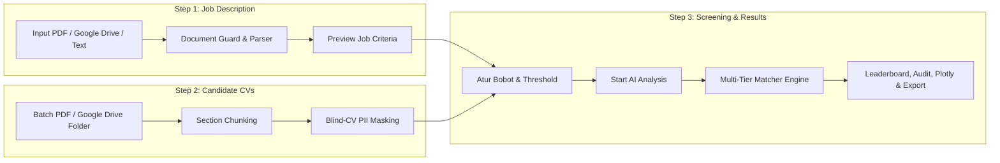

# 🤖 Autonomous Candidate Screening Platform (TalentAI Engine)

> **AI Specialist Technical Assessment Solution**  
> Platform penapisan dan seleksi CV kandidat otomatis berbasis AI end-to-end dengan sistem **Ethical Blind Anonymization**, **Hierarchical Section Chunking**, **Dense Semantic Vector Embeddings**, **Anti-Hallucination Domain Scoring Engine**, dan **Explainable AI (XAI)**.

[](https://www.python.org/)
[](https://streamlit.io/)
[](https://ai.google.dev/)
[](https://openai.com/)
[](https://opensource.org/licenses/MIT)

---

## 📑 Daftar Isi
1. [Ringkasan Platform](#-ringkasan-platform)
2. [Alur Kerja Aplikasi (3-Step Workflow)](#-alur-kerja-aplikasi-3-step-workflow)
3. [Arsitektur Algoritma & Formula Penilaian](#-arsitektur-algoritma--formula-penilaian)
4. [Fitur Unggulan Dashboard & Visual Analytics](#-fitur-unggulan-dashboard--visual-analytics)
5. [Tech Stack yang Digunakan](#-tech-stack-yang-digunakan)
6. [Struktur Repositori](#-struktur-repositori)
7. [Panduan Instalasi & Menjalankan Aplikasi](#-panduan-instalasi--menjalankan-aplikasi)
8. [Dokumentasi PRD](#-dokumentasi-prd)

---

## 🌟 Ringkasan Platform

Autonomous Candidate Screening Platform dirancang untuk mengatasi inefisiensi dan bias pada proses rekrutmen massal (*high-volume hiring*). Platform ini mampu menganalisis puluhan hingga ratusan CV dalam hitungan detik (< 2.5 detik per CV), mencocokkan kualifikasi secara mendalam (*lexical & dense semantic*), serta menyajikan laporan penapisan transparan yang dapat dipertanggungjawabkan kepada *Hiring Manager*.

### 🚀 Fitur Utama:
- 🛡️ **Ethical Blind Screening (Anti-Bias Shield):** Sensor otomatis terhadap 8 kategori data pribadi PII (*Personally Identifiable Information*) seperti Nama, Foto, Gender, Umur, Alamat, dan Institusi untuk menjamin penilaian objektif berbasis kompetensi murni (*Merit-Based Assessment*).
- 🧩 **Hierarchical Section Chunking:** Pemartisian tata letak CV ke dalam seksi terisolasi (*Header, Experience, Education, Skills, Certifications*) untuk mencegah kontaminasi silang entitas dokumen.
- ⚡ **Dense Semantic Vector Embeddings:** Penilaian kecocokan semantik kontekstual menggunakan representasi vektor berdimensi tinggi (`text-embedding-004` / `text-embedding-3-small`) dengan skala normalisasi non-linear.
- 🎯 **Domain Role Validation & Anti-Hallucination Filter:** Memvalidasi relevansi pengalaman kerja dan kesesuaian rumpun jurusan secara ketat untuk mencegah kandidat lintas domain memperoleh skor tinggi.
- 📊 **Explainable AI (XAI):** Rincian skor komprehensif, analisis Kekuatan (*Pros*), Area Pertimbangan (*Cons*), dan Rekomendasi Keputusan Eksekutif (*Decision Rationale*).
- 🎛️ **Kontrol Bobot Dinamis & Smart In-Memory Caching:** Bobot penilaian (*Skill %, Experience %, Education %*) dan ambang kelulusan (*Threshold %*) dapat disesuaikan secara fleksibel dengan proteksi *In-Memory Caching* agar tidak terjadi pemanggilan API AI berulang saat mengubah parameter.
- 📈 **Plotly Interactive Visual Analytics:** 3 moda visualisasi data (Stacked Composite Contribution 0–100%, Grouped Multi-Metric Comparison, dan Competency Radar Analysis).
- 📑 **Dual Report Export:** Ekspor hasil seleksi ke format CSV dan Microsoft Excel (`.xlsx`) lengkap dengan pewarnaan status dan filter status.

---

## 🔄 Alur Kerja Aplikasi (3-Step Workflow)

Aplikasi berjalan melalui 3 tahapan terstruktur pada antarmuka Streamlit:



### Penjelasan Tahapan:
1. **Step 1 — Job Position & Criteria Setup:**
   - Pengguna mengunggah berkas PDF JD, memasukkan tautan Google Drive publik, atau mengetik teks lowongan.
   - Klik tombol **`Preview Job Criteria`** untuk mengekstrak dan menampilkan kriteria jabatan (*Position, Major, Education, Experience, Technical Skills, Soft Skills, Responsibilities*).
2. **Step 2 — Candidate CV Ingestion & Blind Anonymization:**
   - Pengguna mengunggah berkas CV pelamar (PDF) atau memasukkan tautan folder Google Drive (lengkap dengan daftar file preview, ukuran KB/MB, dan tombol hapus satuan `✖`).
   - Toggle **`Blind-CV Anonymization`** menyamarkan data sensitif menjadi alias unik (`CANDIDATE-01`, `CANDIDATE-02`, dst.) sebelum dievaluasi.
3. **Step 3 — Scoring Configuration & 4-Tab Results Dashboard:**
   - Pengguna mengatur *Pass Threshold* dan bobot kriteria (*Skill Match %, Experience Depth %, Education %*), atau mereset ke standar 50:30:20 dengan tombol **`Reset Weights`**.
   - Klik tombol **`Start AI Analysis`** untuk mengeksekusi penilaian AI (dilengkapi *fullscreen loading overlay backdrop*).
   - Menampilkan hasil pada 4 Tab: **Leaderboard & Screening Results**, **Blind-CV Anonymization**, **Analytics & Distribution**, dan **Summary Table** (Export CSV / Excel `.xlsx`).

---

## 🧠 Arsitektur Algoritma & Formula Penilaian

```
┌────────────────────────────────────────────────────────────────────────────────────────┐
│                        TALENTAI MULTI-TIER EVALUATION ENGINE                           │
├────────────────────────────────────────────────────────────────────────────────────────┤
│  1. HIERARCHICAL SECTION CHUNKING & ISOLATED ENTITY SEGMENTATION                       │
│     Pemartisian layout CV -> [HEADER] | [EXPERIENCE] | [EDUCATION] | [SKILLS]          │
├────────────────────────────────────────────────────────────────────────────────────────┤
│  2. ETHICAL BLIND PII ANONYMIZATION                                                    │
│     Masking: Nama -> CANDIDATE-XX, Phone -> [MASKED], Uni -> ACCREDITED INSTITUTION    │
├────────────────────────────────────────────────────────────────────────────────────────┤
│  3. MULTI-TIER HYBRID SCORING ENGINE                                                   │
│     ├── Tier 1: Knockout Filter (Min. Durasi Pengalaman & Lisensi Wajib)               │
│     ├── Tier 2A: Dense Vector Embedding Cosine Similarity (text-embedding-004)         │
│     ├── Tier 2B: Decoupled Tech/Soft Skill Scoring (Tech 75%, Soft 15%, Vector 10%)    │
│     ├── Tier 2C: Domain Experience Relevance (Token Overlap Jaccard Matching)          │
│     └── Tier 2D: Education Level & Major Alignment Scoring                             │
├────────────────────────────────────────────────────────────────────────────────────────┤
│  4. CRITICAL DOMAIN MISMATCH PENALTY FILTER                                            │
│     0 Tech Match + 0 Relevant Exp -> Cap Skor Overall <= 22% - 28% (Status: Rejected)  │
├────────────────────────────────────────────────────────────────────────────────────────┤
│  5. EXPLAINABLE AI (XAI) REASONING ENGINE                                              │
│     Generasi Natural Language: Strengths (Pros), Gaps (Cons), & Executive Rationale    │
└────────────────────────────────────────────────────────────────────────────────────────┘
```

### 1. Hierarchical Section Chunking
Algoritma segmentasi tata letak dokumen yang memotong teks CV ke dalam blok semantik terisolasi sebelum ekstraksi entitas dijalankan:
- `P_exp` = `(?:WORK EXPERIENCE|PROFESSIONAL EXPERIENCE|EXPERIENCE|PENGALAMAN KERJA)`
- `P_edu` = `(?:EDUCATION|PENDIDIKAN|RIWAYAT PENDIDIKAN|ACADEMIC BACKGROUND)`
- `P_skill` = `(?:SKILLS & ABILITIES|TECHNICAL SKILLS|SKILLS|KEAHLIAN|COMPETENCIES)`
- `P_cert` = `(?:CERTIFICATIONS|CERTIFICATES|SERTIFIKAT|ACHIEVEMENTS)`

### 2. Dense Semantic Vector Embeddings & Cosine Similarity
Pemetaan representasi teks profil lowongan kerja ($\mathbf{u}$) dan profil pelamar ($\mathbf{v}$) ke dalam ruang vektor berdimensi tinggi (*768-dim* pada Gemini `text-embedding-004` atau *1536-dim* pada OpenAI `text-embedding-3-small`):

- **Formula Cosine Similarity:**

$$
\cos(\theta) = \frac{\mathbf{u} \cdot \mathbf{v}}{\|\mathbf{u}\|_2 \|\mathbf{v}\|_2} = \frac{\sum_{i=1}^n u_i v_i}{\sqrt{\sum_{i=1}^n u_i^2} \cdot \sqrt{\sum_{i=1}^n v_i^2}}
$$

- **Formula Normalisasi Non-Linear ($S_{\text{semantic}}$):**

$$
S_{\text{semantic}} = \min\left(100.0, \; \max\left(0.0, \; \frac{\cos(\theta) \times 100 - 35.0}{0.55}\right)\right)
$$

### 3. Decoupled Skills Matching ($S_{\text{skill}}$)
Keahlian teknis (*Hard Skills*) dipisahkan secara tegas dari *Soft Skills* untuk mencegah pelamar tanpa keahlian inti lolos seleksi:

$$
R_{\text{tech}} = \frac{N_{\text{tech}}}{\max(N_{\text{jd,tech}}, 1)}, \quad R_{\text{soft}} = \frac{N_{\text{soft}}}{\max(N_{\text{jd,soft}}, 1)}
$$

**Formula Penilaian Keahlian:**

$$
S_{\text{skill}} = 
\begin{cases} 
\min\left(15.0, \; (R_{\text{soft}} \times 10.0) + (S_{\text{semantic}} \times 0.05)\right), & \text{jika } N_{\text{tech}} = 0 \\
(R_{\text{tech}} \times 75.0) + (R_{\text{soft}} \times 15.0) + (\min(100.0, S_{\text{semantic}}) \times 0.10), & \text{jika } N_{\text{tech}} > 0 
\end{cases}
$$

### 4. Domain Experience Relevance ($S_{\text{exp}}$) & Education ($S_{\text{edu}}$)
Pengalaman kerja dinilai berdasarkan keselarasan kata kunci domain profesi ($D$):

$$
\text{Years}_{\text{relevant}} = \sum_{i} \left( \text{Duration}_i \times \text{Relevance}_i \right)
$$

$$
S_{\text{exp}} = 
\begin{cases} 
\min\left(100.0, \; \frac{\text{Years}_{\text{relevant}}}{\text{MinExp}} \times 100.0\right), & \text{jika } \text{Years}_{\text{relevant}} > 0 \\
\min\left(10.0, \; \frac{\sum \text{Duration}_i}{\text{MinExp}} \times 10.0\right), & \text{jika } \text{Years}_{\text{relevant}} = 0 
\end{cases}
$$

$$
S_{\text{edu}} = (S_{\text{deg}} \times 0.40) + (S_{\text{major}} \times 0.60)
$$

### 5. Critical Domain Mismatch Filter & Status Rekomendasi
Skor komposit mentah dihitung berdasarkan bobot dinamis:

$$
S_{\text{raw}} = (S_{\text{skill}} \times W_{\text{skill}}) + (S_{\text{exp}} \times W_{\text{exp}}) + (S_{\text{edu}} \times W_{\text{edu}})
$$

$$
W_{\text{skill}} = 0.50, \quad W_{\text{exp}} = 0.30, \quad W_{\text{edu}} = 0.20 \quad \text{(Bobot Standar Default)}
$$

Jika kandidat memiliki **0 technical skill relevan** dan **0 tahun pengalaman kerja relevan**:

$$
S_{\text{overall}} = 
\begin{cases} 
\min(22.0, \; S_{\text{raw}}), & \text{jika } S_{\text{major}} \le 50.0 \text{ (Jurusan berbeda total)} \\
\min(28.0, \; S_{\text{raw}}), & \text{jika } S_{\text{major}} > 50.0 \\
S_{\text{raw}}, & \text{kandidat dalam domain relevan}
\end{cases}
$$

**Klasifikasi Status:**

$$
\text{Status} = 
\begin{cases} 
\mathbf{Pass}, & \text{jika } S_{\text{overall}} \ge \text{Threshold} \land \text{HardFilterPassed} \\
\mathbf{Considered}, & \text{jika } S_{\text{overall}} \ge \max(\text{Threshold} - 15.0, \; 45.0) \\
\mathbf{Rejected}, & \text{lainnya}
\end{cases}
$$

---

## 📊 Fitur Unggulan Dashboard & Visual Analytics

| Tab Dashboard | Fitur & Komponen Utama |
| :--- | :--- |
| **1. Leaderboard & Screening Results** | 3 kartu metrik (*Total Processed, Shortlisted, Average Match Score*), kartu profil terurut dengan badge status (*Pass: Hijau, Considered: Kuning, Rejected: Merah*), dan kartu ulasan XAI mendalam (*Pros, Cons, Decision Rationale*). |
| **2. Blind-CV Anonymization** | Audit inspector berdampingan (*Side-by-Side Comparison*) antara data asli pelamar (*Raw CV JSON*) dengan data tersanitasi (*Blind-CV JSON*) yang diproses oleh AI. |
| **3. Analytics & Distribution** | Visualisasi interaktif berbasis Plotly berskala 0–100% dengan 3 moda: (1) **Stacked Composite Contribution**, (2) **Grouped Multi-Metric Comparison**, dan (3) **Competency Radar Analysis**. |
| **4. Summary & Data Export** | Tabel ringkasan komprehensif dengan kolom *Rank, Candidate Name, Email, Phone, Overall Match Score, Status, dan Reason*, dropdown filter status, tombol **Export CSV**, dan tombol **Export Excel (.xlsx)** via `openpyxl`. |

---

## 🛠️ Tech Stack yang Digunakan

| Kategori | Teknologi / Library | Fungsi Utama |
| :--- | :--- | :--- |
| **Frontend UI & Visualisasi** | `Streamlit` (v1.30+) | Antarmuka dashboard rekrutmen interaktif, responsif, dan berbasis komponen. |
| | `Plotly` (`plotly.express`, `graph_objects`) | Visualisasi distribusi skor, radar chart kompetensi, dan bar ranking kandidat. |
| | `Pandas` | Manipulasi tabel leaderboard, agregasi data penilaian, dan ekspor CSV. |
| **NLP & Document Parsing** | `PyPDF` (`pypdf`) | Ekstraksi teks digital dari berkas PDF Job Description & CV pelamar. |
| | `Regular Expressions (re)` | Hierarchical Section Chunking, Token Normalization, & PII Sanitizer. |
| **AI Models & LLM Framework** | `google-genai` / `google.generativeai` | Google Gemini (`gemini-3.1-pro-preview`, `gemini-3.5-flash`, `gemini-3-flash-preview`, `text-embedding-004`). |
| | `openai` | OpenAI SDK (`gpt-4o-mini`, `gpt-4o`, `text-embedding-3-small`). |
| **Offline Fallback Engine** | Sparse TF-IDF Term Vectorizer | Ekstraksi fitur teks dan komputasi cosine similarity saat mode offline/tanpa token API. |
| | Rule-Based XAI Reasoner | Engine sintesis Pros/Cons dan Executive Rationale tanpa dependensi eksternal. |
| **Integrasi & Utilitas** | `gdown` | Pengunduhan otomatis berkas PDF/Folder dari tautan publik Google Drive. |
| | `openpyxl` | Penulisan berkas spreadsheet Microsoft Excel (.xlsx) resmi dengan styling status. |

---

## 🗂️ Struktur Repositori

```
Autonomous_Candidate_Screening_Platform/
├── .streamlit/
│   └── config.toml                  # Konfigurasi batas upload (200MB) & UI Web
├── sample_data/
│   ├── job_descriptions.json        # Dataset acuan kriteria lowongan posisi
│   ├── sample_cvs.json              # Dataset acuan profil kandidat terstruktur
│   ├── cv/                          # Berkas PDF CV kandidat pengujian
│   └── vacancy/                     # Berkas PDF Job Description acuan
├── src/
│   ├── __init__.py
│   ├── anonymizer.py                # Ethical PII Masking & Blind-CV Engine
│   ├── parser.py                    # Layout-Aware PDF Parser & Section Chunking Algorithm
│   ├── matcher.py                   # Multi-Tier Scoring, Vector Embeddings, & Domain Validation
│   ├── drive_importer.py            # Google Drive Folder & File Ingestion Module
│   ├── ui_components.py             # Fullscreen Loading Overlay Backdrop Component
│   ├── config.py                    # Environment & API Key Configuration Reader
│   └── app.py                       # Interactive Streamlit Web Application Dashboard
├── .env.example                     # Template variabel lingkungan API Key
├── PRD.md                           # Comprehensive Product Requirement Document
├── Presentation_Deck.md             # Format Slide Presentasi Teknis Proyek
├── README.md                        # Panduan Teknis & Dokumentasi Repositori
└── requirements.txt                 # Daftar Dependensi Python
```

---

## 🚀 Panduan Instalasi & Menjalankan Aplikasi

### 1. Kloning Repositori & Persiapan Lingkungan
`ash
git clone https://github.com/rrexzra36/Autonomous_Candidate_Screening_Platform.git
cd Autonomous_Candidate_Screening_Platform
`

### 2. Buat Virtual Environment & Install Dependensi
`ash
# Menggunakan Python 3.10, 3.11, atau 3.12
python -m venv venv

# Aktivasi di Windows:
.env\Scriptsctivate

# Aktivasi di Linux/macOS:
source venv/bin/activate

# Install dependensi:
pip install -r requirements.txt
`

### 3. Konfigurasi Environment Variable (Opsional)
Salin berkas .env.example menjadi .env jika ingin menyematkan API Key secara permanen:
`ash
cp .env.example .env
`
*(Anda juga dapat memasukkan API Key Gemini / OpenAI langsung melalui panel Sidebar di antarmuka web Streamlit).*

### 4. Jalankan Aplikasi Streamlit
`ash
streamlit run src/app.py
`
Aplikasi akan terbuka otomatis di browser pada alamat: http://localhost:8501.

---

## 📚 Dokumentasi PRD

Untuk mempelajari spesifikasi produk, arsitektur teknis mendalam, formula matematis terinci, alur interaksi, serta kontrak schema JSON secara lengkap, silakan pelajari:
👉 [**Product Requirement Document (PRD.md)**](file:///D:/Github/Autonomous_Candidate_Screening_Platform/PRD.md)

---

## 📄 Lisensi & Kontributor
* **Author:** AI/ML Specialist Candidate
* **Project:** Autonomous Candidate Screening Platform (TalentAI Engine)
* **Lisensi:** MIT License (2026)
